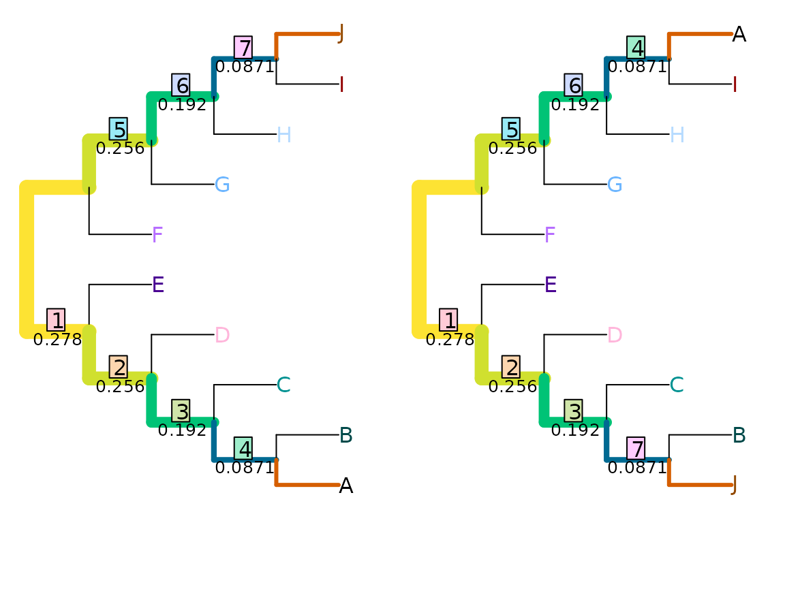
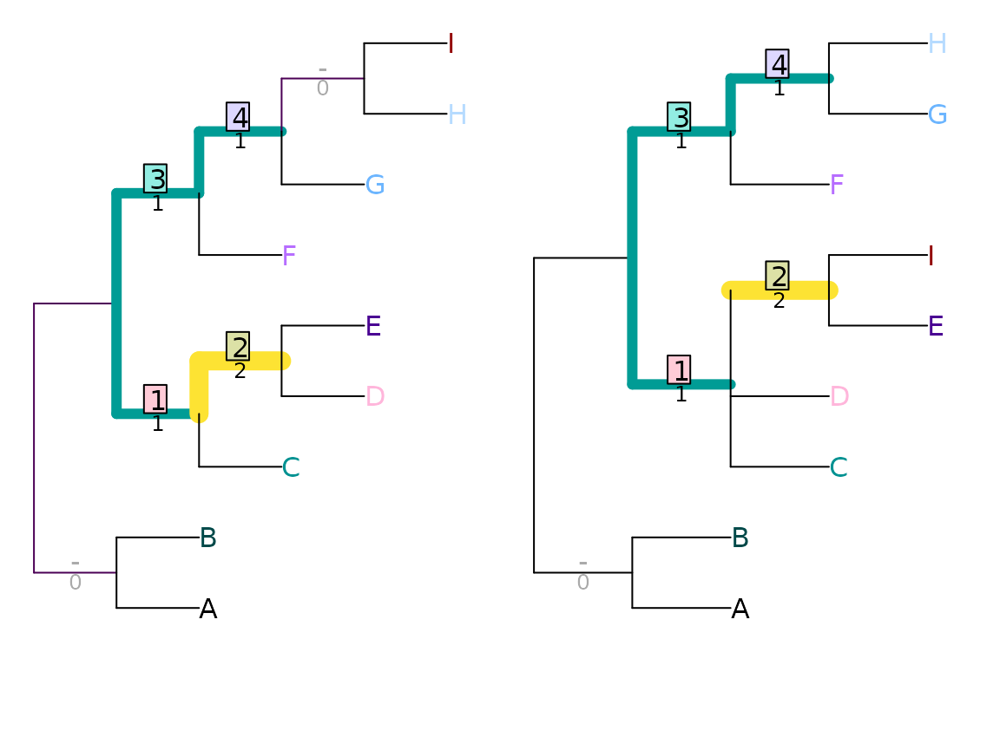
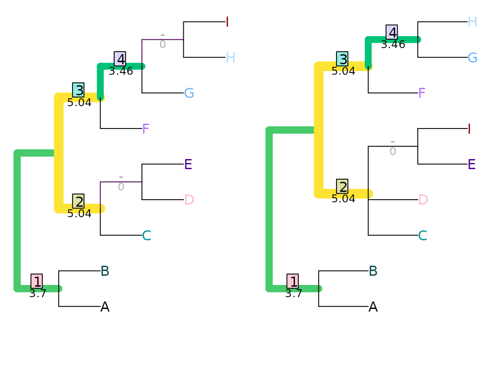

# Generalized Robinson-Foulds distances

This document outlines the similarity measures employed by the
generalized Robinson–Foulds distances implemented in this package.

Generalized RF distances are introduced
[elsewhere](https://ms609.github.io/TreeDist/articles/Robinson-Foulds.md);
before you read further, you may also wish to revisit how to [use the
‘TreeDist’
package](https://ms609.github.io/TreeDist/articles/Using-TreeDist.md),
and relevant [principles of information
theory](https://ms609.github.io/TreeDist/articles/information.md).

## Shared phylogenetic information

Under the shared phylogenetic information tree distance measure (Smith,
2020), pairs of splits are assigned a similarity score that corresponds
to the amount of phylogenetic information (*sensu* Steel & Penny, 2006)
that they share in common (see [separate
vignette](https://ms609.github.io/TreeDist/articles/information.md)), a
concept introduced (though not developed) by Nelson (1979).

``` r
VisualizeMatching(SharedPhylogeneticInfo, tree1, tree2, 
                  Plot = TreeDistPlot, matchZeros = FALSE)
```


``` r
SharedPhylogeneticInfo(tree1, tree2)
```

    ## [1] 12.32188

This distance is measured in bits; on this measure, the total
information content of a tree is given by

``` r
SplitwiseInfo(tree1)
```

    ## [1] 28.67404

### Conflicting splits can nevertheless be instructive

Shared phylogenetic information assigns zero similarity to incompatible
splits, i.e. those that cannot both occur on a single tree. This leads
to problematic behaviour in certain cases: for example, swapping the
position of two distant leaves (as with leaves ‘A’ and ‘J’ below) can
disproportionately reduce similarity – in this example, to zero.

``` r
VisualizeMatching(SharedPhylogeneticInfo, AtoJ, swapAJ,
                  Plot = TreeDistPlot, matchZeros = FALSE, prune = c(5, 18))
```


## Mutual clustering information

Scoring each pair of splits according to their mutual clustering
information (Smith, 2020) (see [separate
vignette](https://ms609.github.io/TreeDist/articles/information.md))
results in a information-based tree distance metric that recognizes
similarity in tree structure even when every possible pairing of splits
conflicts:

``` r
VisualizeMatching(MutualClusteringInfo, AtoJ, swapAJ,
                  Plot = TreeDistPlot, matchZeros = FALSE, prune = c(5, 18))
```



``` r
MutualClusteringInfo(AtoJ, swapAJ)
```

    ## [1] 1.348339

Because no pair of non-trivial splits has zero mutual clustering
information, even a dissimilar pairing (such as `HI|ABCDEFG` ⇒
`EI|ABCDFGH` below) is (slightly) preferable to leaving a split
unpaired.

``` r
VisualizeMatching(MutualClusteringInfo, tree1, tree2, 
                  Plot = TreeDistPlot, matchZeros = FALSE)
```


The total mutual clustering information in a single tree is given by

``` r
ClusteringEntropy(tree1)
```

    ## [1] 5.120281

## Nye *et al.* tree similarity metric

The Nye *et al*. (2006) tree similarity metric scores pairs by
considering the elements held in common between subsets of each split.

Consider a pair of splits `ABCDEF|GHIJ` and `ABCDEIJ|FGH`. These can be
aligned thus:

    ABCDEF  | GHIJ
    ABCDE IJ|FGH

The first pair of subsets, `ABCDEF` and `ABCDEIJ`, have five elements in
common (`ABCDE`), and together encompass eight elements (`ABCDEFIJ`).
Their *subset score* is thus $\frac{5}{8}$.

The second pair of subsets, `GHIJ` and `FGH`, have two elements (`GH`)
in common, of the five total (`FGHIJ`), and hence receive a subset score
of $\frac{2}{5}$.

This split alignment then receives an *alignment score* corresponding to
the lower of the two subset scores, $\frac{2}{5}$.

We must now consider the other alignment of this pair of splits,

    ABCDEF  |     GHIJ
         FGH|ABCDE  IJ

This yields subset scores of $\frac{1}{8}$ and $\frac{2}{9}$, and thus
has an alignment score of $\frac{1}{8}$. This alignment gives a lower
score than the other, so is disregarded. The pair of splits is allocated
a similarity score corresponding to the better alignment: $\frac{2}{5}$.

As such, splits that match exactly will receive a similarity score of 1,
in a manner analogous to the Robinson–Foulds distance. (This is despite
the fact that some splits are more likely to match than others.) It is
not possible for a pair of splits to receive a zero similarity score.

``` r
VisualizeMatching(NyeSimilarity, tree1, tree2, 
                  Plot = TreeDistPlot, matchZeros = FALSE)
```


``` r
NyeSimilarity(tree1, tree2, normalize = FALSE)
```

    ## [1] 3.5

### Jaccard–Robinson–Foulds metric

Böcker *et al*. (2013) employ the same split similarity calculation as
Nye *et al.* (above), which they suggest ought to be raised to an
arbitrary exponent in order to down-weight the contribution of paired
splits that are not identical. In order for the metric to converge to
the Robinson–Foulds metric as the exponent grows towards infinity, the
resulting score is then doubled.

``` r
JaccardRobinsonFoulds(tree1, tree2, k = 1)
```

    ## [1] 4

``` r
VisualizeMatching(JaccardRobinsonFoulds, tree1, tree2,
                  Plot = TreeDistPlot, matchZeros = FALSE)
```


``` r
JRF2 <- function(...) JaccardRobinsonFoulds(k = 2, ...)
JRF2(tree1, tree2)
```

    ## [1] 5.638889

``` r
VisualizeMatching(JRF2, tree1, tree2,
                  Plot = TreeDistPlot, matchZeros = FALSE)
```


The figure below shows how the JRF distance between the two trees
plotted above varies with the value of the exponent *k*, relative to the
Nye *et al.* and Robinson–Foulds distances between the trees:


The theoretical and practical performance of the JRF metric, and its
speed of calculation, are best at lower values of *k* (Smith, 2020),
raising the question of whether an exponent is useful.

Böcker *et al*. (2013) suggest that ‘reasonable’ matchings exhibit a
property they term *arboreality*. Their definition of an arboreal
matching supposes that trees are rooted, in which case each split
corresponds to a clade. In an arboreal matching on a rooted tree, no
pairing of splits conflicts with any other pairing of splits. Consider
the case where splits ‘A’ and ‘B’ in tree 1 are paired respectively with
splits ‘C’ and ‘D’ in tree 2. If ‘A’ is paired with ‘C’ and ‘B’ with
‘D’, then to avoid conflict:

- if A is nested within B, then C must be nested within D

- if B is nested within A, then D must be nested within C

- if A and B do not overlap, then C and D must not overlap.

Equivalent statements for unrooted trees are a little harder to express.

Unfortunately, constructing arboreal matchings is NP-complete, making an
optimal arboreal matching slow to find. A faster alternative is to
prohibit pairings of contradictory splits, though distances generated
under such an approach are theoretically less coherent and practically
no more effective than those calculated when contradictory splits may be
paired, so the only advantage of this approach is a slight increase in
calculation speed (Smith, 2020).

## Matching Split Distance

Bogdanowicz & Giaro (2012) propose an alternative distance, which they
term the Matching Split Distance. (This approach was independently
proposed by Lin *et al.* (2012).)

``` r
MatchingSplitDistance(tree1, tree2)
```

    ## [1] 5

``` r
VisualizeMatching(MatchingSplitDistance, tree1, tree2,
                  Plot = TreeDistPlot, matchZeros = FALSE)
```



Note that the visualization shows the difference, rather than the
similarity, between splits.

Similar to the Nye *et al*. similarity metric, this method compares the
subsets implied by a pair of splits. Here, the relevant quantity is the
number of elements that must be moved from one subset to another in
order to make the two splits identical. With the pair of splits

    ABCDEF  | GHIJ
    ABCDE IJ|FGH

three leaves (‘F’, ‘I’ and ‘J’) must be moved before the splits are
identical; as such, the pair of splits are assigned a difference score
of three.  
Formally, where $S_{i}$ splits $n$ leaves into bipartitions $A_{i}$ and
$B_{i}$, the difference score is calculated by

$n - m$

where $m$ counts the number of leaves that already match, and is defined
as

$m = \max\{\left| A_{1} \cap A_{2} \right| + \left| B_{1} \cap B_{2} \right|,\left| A_{1} \cap B_{2} \right| + \left| B_{1} \cap A_{2} \right|\}$

``` r
MatchingSplitDistance(read.tree(text='((a, b, c, d, e, f), (g, h, i, j));'),
                      read.tree(text='((a, b, c, d, e, i, j), (g, h, f));'))
```

    ## [1] 3

This distance is difficult to normalize, as it is not easy to calculate
its maximum value.

### Information theoretic alternative

In the matching split distance, $m$ represents a simple count of the
number of shared taxa. An alternative is to measure the phylogenetic
information content of the largest split consistent with $S_{1}$ and
$S_{2}$:

$m = \max\{ h\left( A_{1} \cap A_{2}|B_{1} \cap B_{2} \right),h\left( A_{1} \cap B_{2}|B_{1} \cap A_{2} \right)\}$

The most information-rich split consistent with

    ABCDEF  | GHIJ
    ABCDE IJ|FGH  

is `ABCDE | GH`, which contains

``` r
TreeTools::SplitInformation(5, 2)
```

    ## [1] 3.169925

bits of phylogenetic information. This value can be used as a similarity
score for this pairing of splits.

``` r
MatchingSplitInfoDistance(tree1, tree2)
```

    ## [1] 17.27586

``` r
VisualizeMatching(MatchingSplitInfoDistance, tree1, tree2,
                  Plot = TreeDistPlot, matchZeros = FALSE)
```



## References

Böcker, S., Canzar, S., & Klau, G. W. (2013). The generalized
Robinson-Foulds metric. In A. Darling & J. Stoye (Eds.), *Algorithms in
Bioinformatics. WABI 2013. Lecture Notes in Computer Science, vol 8126*
(pp. 156–169). Berlin, Heidelberg: Springer. doi:
[10.1007/978-3-642-40453-5_13](https://doi.org/10.1007/978-3-642-40453-5_13)

Bogdanowicz, D., & Giaro, K. (2012). Matching split distance for
unrooted binary phylogenetic trees. *IEEE/ACM Transactions on
Computational Biology and Bioinformatics*, *9*(1), 150–160. doi:
[10.1109/TCBB.2011.48](https://doi.org/10.1109/TCBB.2011.48)

Lin, Y., Rajan, V., & Moret, B. M. E. (2012). A metric for phylogenetic
trees based on matching. *IEEE/ACM Transactions on Computational Biology
and Bioinformatics*, *4*(9), 1014–1022. doi:
[10.1109/TCBB.2011.157](https://doi.org/10.1109/TCBB.2011.157)

Nelson, G. (1979). Cladistic analysis and synthesis: Principles and
definitions, with a historical note on Adanson’s *Familles des Plantes*
(1763–1764). *Systematic Biology*, *28*(1), 1–21. doi:
[10.1093/sysbio/28.1.1](https://doi.org/10.1093/sysbio/28.1.1)

Nye, T. M. W., Liò, P., & Gilks, W. R. (2006). A novel algorithm and
web-based tool for comparing two alternative phylogenetic trees.
*Bioinformatics*, *22*(1), 117–119. doi:
[10.1093/bioinformatics/bti720](https://doi.org/10.1093/bioinformatics/bti720)

Smith, M. R. (2020). Information theoretic Generalized Robinson-Foulds
metrics for comparing phylogenetic trees. *Bioinformatics*, *36*(20),
5007–5013. doi:
[10.1093/bioinformatics/btaa614](https://doi.org/10.1093/bioinformatics/btaa614)

Steel, M. A., & Penny, D. (2006). Maximum parsimony and the phylogenetic
information in multistate characters. In V. A. Albert (Ed.), *Parsimony,
phylogeny, and genomics* (pp. 163–178). Oxford: Oxford University Press.
