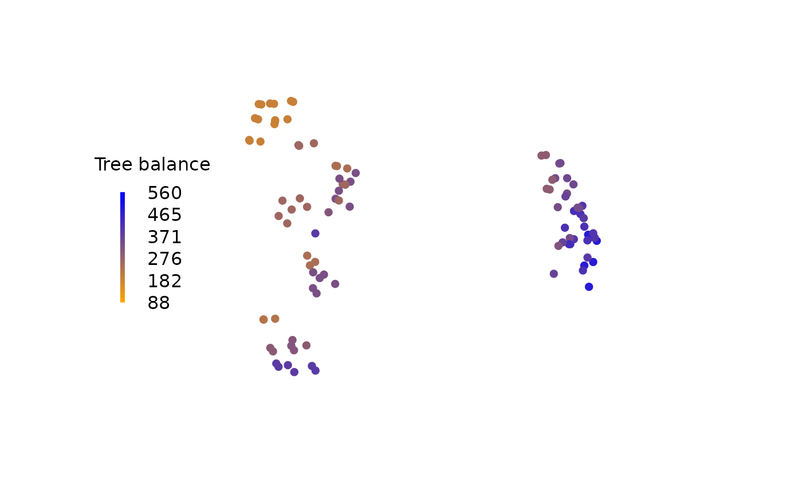

# Analysing landscapes of phylogenetic trees

Landscapes of trees are [mappings of tree
space](https://ms609.github.io/TreeDist/articles/treespace.md) that are
contoured according to some optimality criterion – often, but not
necessarily, a tree’s score under a phylogenetic reconstruction
technique (Bastert, Rockmore, Stadler, & Tinhofer, 2002). Detecting
“islands” or “terraces” of trees can illuminate the nature of the space
of optimal trees and thus inform tree search strategy (Maddison, 1991;
Sanderson, McMahon, & Steel, 2011).

For simplicity (and to avoid scoring trees against a dataset), this
example uses a tree’s balance (measured using the total cophenetic
index) as its score (Mir, Rosselló, & Rotger, 2013). We assume that
mappings have already been shown to be
[adequate](https://ms609.github.io/TreeDist/articles/treespace.md)
(Smith, 2022).

A landscape is most simply visualized by colouring each tree according
to its score:

``` r
# Load required libraries
library("TreeTools", quietly = TRUE)
library("TreeDist")

# Generate a set of trees
trees <- as.phylo(as.TreeNumber(BalancedTree(16)) + 0:100 - 15, 16)

# Create a 2D mapping
distances <- ClusteringInfoDist(trees)
mapping <- cmdscale(distances, 2)

# Score trees according to their balance
scores <- TotalCopheneticIndex(trees)

# Normalize scores
scoreMax <- TCIContext(trees[[1]])[["maximum"]]
scoreMin <- TCIContext(trees[[1]])[["minimum"]]
scores <- scores - scoreMin
scores <- scores / (scoreMax - scoreMin)

# Generate colour palette
col <- colorRamp(c("orange", "blue"))(scores)
rgbCol <- rgb(col, maxColorValue = 255)

# Plot trees, coloured by their score
plot(
  mapping,
  asp = 1, # Preserve aspect ratio - do not distort distances
  ann = FALSE, axes = FALSE, # Don't label axes: dimensions are meaningless
  col = rgbCol, # Colour trees by score
  pch = 16 # Plotting character: Filled circle
)

# Add a legend
PlotTools::SpectrumLegend(
  "left",
  title = "Tree balance",
  palette = rgb(colorRamp(c("orange", "blue"))(0:100 / 100) / 255),
  legend = floor(seq(scoreMax, scoreMin, length.out = 6)),
  bty = "n"
)
```



A more sophisticated output can be produced using contours,
interpolating between adjacent trees. This example uses a simple inverse
distance weighting function for interpolation; more sophisticated
techniques such as
[kriging](https://desktop.arcgis.com/en/arcmap/10.3/tools/3d-analyst-toolbox/how-kriging-works.htm)
or (in continuous tree spaces) the use of geodesics (Khodaei, Owen, &
Beerli, 2022) can produce even better results.

``` r
# Use an inverse distance weighting to interpolate between measured points
Predict <- function (x, y) {
  Distance <- function (a, b) {
    apply(a, 2, function (pt) sqrt(colSums((pt - b) ^ 2)))
  }
  predXY <- rbind(x, y)
  dists <- Distance(t(mapping), predXY)
  invDist <- 1 / dists
  weightings <- invDist / rowSums(invDist)

  # Return:
  colSums(scores * t(weightings))
}

# Generate grid for contour plot
resolution <- 32
xLim <- range(mapping[, 1]) * 1.1
yLim <- range(mapping[, 2]) * 1.11
x <- seq(xLim[1], xLim[2], length.out = resolution)
y <- seq(yLim[1], yLim[2], length.out = resolution)
z <- outer(x, y, Predict) # Predicted values for each grid square

# Plot
filled.contour(
  x, y, z,
  asp = 1, # Preserve aspect ratio - do not distort distances
  ann = FALSE, axes = FALSE, # Don't label axes: dimensions are meaningless
  plot.axes = {points(mapping, xpd = NA)} # Use filled.contour coordinates
)
```


A variety of R add-on packages facilitate three-dimensional plots.

``` r
if (requireNamespace("plotly", quietly = TRUE)) {
  library("plotly", quietly = TRUE)
  fig <- plot_ly(x = x, y = y, z = z)
  fig <- fig %>% add_surface()
  fig
} else {
  print("Run `install.packages('plotly')` to view this output")
}
```

(Use the mouse to reorient)

## References

Bastert, O., Rockmore, D., Stadler, P. F., & Tinhofer, G. (2002).
Landscapes on spaces of trees. *Applied Mathematics and Computation*,
*131*(2-3), 439–459. doi:
[10.1016/S0096-3003(01)00164-3](https://doi.org/10.1016/S0096-3003(01)00164-3)

Khodaei, M., Owen, M., & Beerli, P. (2022). Geodesics to characterize
the phylogenetic landscape. *bioR$\chi$iv*. doi:
[10.1101/2022.05.11.491507](https://doi.org/10.1101/2022.05.11.491507)

Maddison, D. R. (1991). The discovery and importance of multiple islands
of most-parsimonious trees. *Systematic Biology*, *40*(3), 315–328. doi:
[10.1093/sysbio/40.3.315](https://doi.org/10.1093/sysbio/40.3.315)

Mir, A., Rosselló, F., & Rotger, L. A. (2013). A new balance index for
phylogenetic trees. *Mathematical Biosciences*, *241*(1), 125–136. doi:
[10.1016/j.mbs.2012.10.005](https://doi.org/10.1016/j.mbs.2012.10.005)

Sanderson, M. J., McMahon, M. M., & Steel, M. (2011). Terraces in
Phylogenetic Tree Space. *Science*, *333*(6041), 448–450. doi:
[10.1126/science.1206357](https://doi.org/10.1126/science.1206357)

Smith, M. R. (2022). Robust analysis of phylogenetic tree space.
*Systematic Biology*, *71*(5), 1255–1270. doi:
[10.1093/sysbio/syab100](https://doi.org/10.1093/sysbio/syab100)
