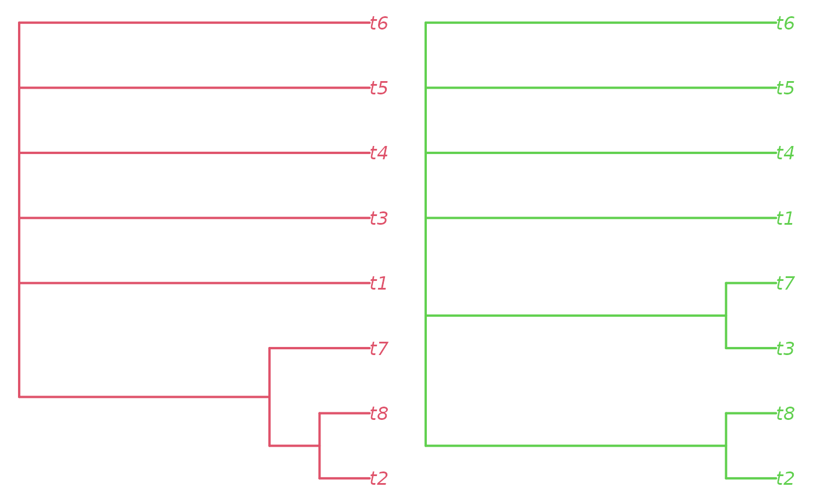
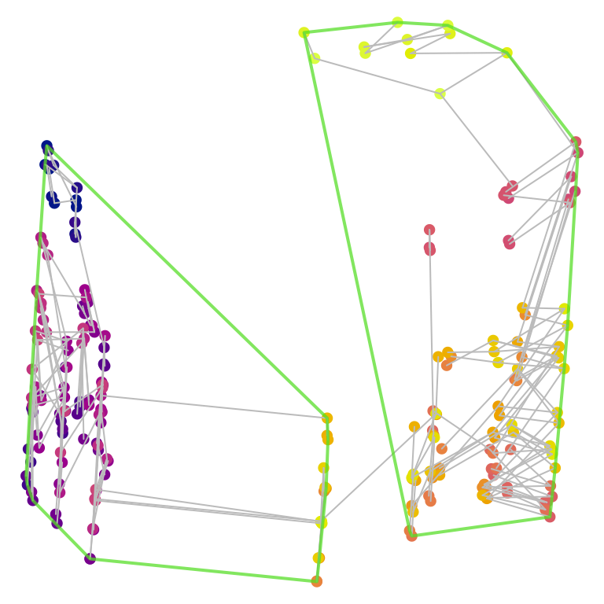
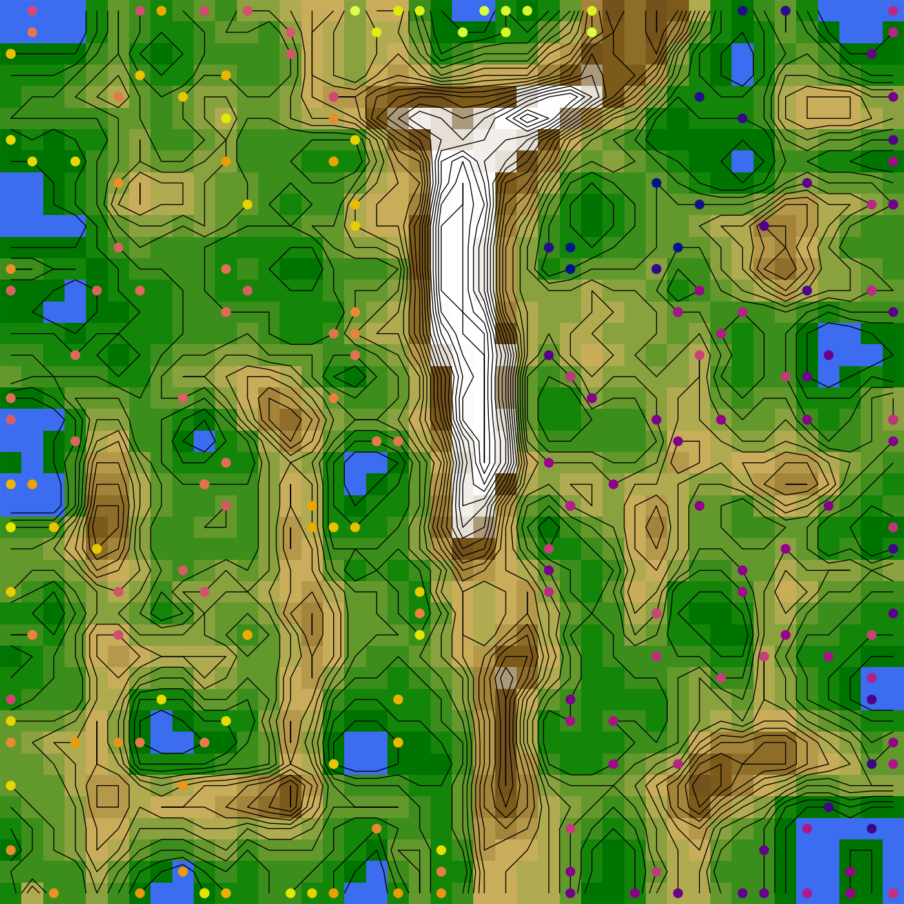

# Tree space analysis

It can be instructive to visualize the distribution of trees by mapping
their spatial relationships. This can be a helpful means to address
whether discrete islands exist in a sample of trees, or whether
analytical runs have converged. Such analysis is relatively simple to
conduct, but a few common oversights can mislead interpretation.

### Tree space analysis via user interface

Tree space mapping and analysis is made simple with the Shiny app
included in the “TreeDist” R package. Simply install
[R](https://www.r-project.org/) or [RStudio](https://posit.co/), then
copy the code below into the R command line:

``` r
install.packages("TreeDist")
TreeDist::MapTrees()
```

This will allow you to conduct and evaluate basic tree space mappings
from tree lists saved in most common file formats; see an [outline of
the basic
functionality](https://ms609.github.io/TreeDist/reference/MapTrees.html).
To avoid misinterpreting tree space, it’s worth having a broad idea of
what an analysis involves, and some potential pitfalls.

### Avoiding common pitfalls in tree space analysis

Here’s an example analysis of a series of 200 trees from an ordered
list. The list corresponds to a mixed-base representation of trees (see
[`TreeTools::as.TreeNumber()`](https://ms609.github.io/TreeTools/reference/TreeNumber.html)),
so is expected to contain some structure as we jump from one “class” of
tree to another. Let’s see whether we can visualize and corroborate this
structure.

First we’ll generate the trees, and load some colours with which we
might identify them.

``` r
library("TreeTools", quietly = TRUE)
treeNumbers <- c(1:220)
trees <- as.phylo(treeNumbers, 8)
spectrum <- hcl.colors(220, "plasma")
treeCols <- spectrum[treeNumbers]
```

#### Using a suitable distance metric

Now we need to calculate the distance between each pair of trees in our
list. The choice of distance metric is important (M. R. Smith, 2022).
The widely used Robinson–Foulds distance is, unfortunately, unsuitable
for tree space analysis. The clustering information distance (M. R.
Smith, 2020) is a reliable alternative that is fast to calculate:

``` r
library("TreeDist")
distances <- ClusteringInfoDistance(trees)
```

The reader is encouraged to repeat the exercise with other distances:

``` r
distances <- RobinsonFoulds(trees)
distances <- PhylogeneticInfoDistance(trees)
distances <- as.dist(Quartet::QuartetDivergence(
  Quartet::ManyToManyQuartetAgreement(trees), similarity = FALSE))
```

#### Mapping distances

Then we need to reduce the dimensionality of these distances. We’ll
start out with a 12-dimensional mapping; if needed, we can always drop
higher dimensions.

Principal coordinates analysis is quick and performs very well:

``` r
mapping <- cmdscale(distances, k = 12)
```

Alternative mapping methods do exist, and sometimes give slightly better
mappings. `isoMDS()` performs non-metric multidimensional scaling (MDS)
with the Kruskal-1 stress function (Kruskal, 1964):

``` r
kruskal <- MASS::isoMDS(distances, k = 12)
mapping <- kruskal$points
```

whereas `sammon()`, one of many metric MDS methods, uses Sammon’s stress
function (Sammon, 1969):

    sammon <- MASS::sammon(distances, k = 12)
    mapping <- sammon$points

That’s a good start. It is tempting to plot the first two dimensions
arising from this mapping and be done:

``` r
par(mar = rep(0, 4))
plot(mapping,
     asp = 1, # Preserve aspect ratio - do not distort distances
     ann = FALSE, axes = FALSE, # Don't label axes: dimensions are meaningless
     col = treeCols, pch = 16
     )
```


#### Identifying clusters

A quick visual inspection suggests at least two clusters, with the
possibility of further subdivision of the brighter trees. But visual
inspection can be highly misleading (M. R. Smith, 2022). We must take a
statistical approach. A combination of partitioning around medoids and
hierarchical clustering with minimax linkage will typically find a
clustering solution that is close to optimal, if one exists (M. R.
Smith, 2022); if suitably initialized, k-means++ clustering (Arthur &
Vassilvitskii, 2007) can also be worthwhile.

``` r
possibleClusters <- 2:10

# Partitioning around medoids
pamClusters <- lapply(possibleClusters, function(k) cluster::pam(distances, k = k))
pamSils <- vapply(pamClusters, function(pamCluster) {
  mean(cluster::silhouette(pamCluster)[, 3])
}, double(1))

bestPam <- which.max(pamSils)
pamSil <- pamSils[bestPam]
pamCluster <- pamClusters[[bestPam]]$cluster

# Hierarchical clustering
hTree <- protoclust(distances)
hClusters <- lapply(possibleClusters, function(k) cutree(hTree, k = k))
hSils <- vapply(hClusters, function(hCluster) {
  mean(cluster::silhouette(hCluster, distances)[, 3])
}, double(1))

bestH <- which.max(hSils)
hSil <- hSils[bestH]
hCluster <- hClusters[[bestH]]

# k-means++ clustering
kClusters <- lapply(possibleClusters, function(k) KMeansPP(distances, k = k))
kSils <- vapply(kClusters, function(kCluster) {
  mean(cluster::silhouette(kCluster$cluster, distances)[, 3])
}, double(1))

bestK <- which.max(kSils)
kSil <- kSils[bestK]
kCluster <- kClusters[[bestK]]$cluster

plot(pamSils ~ possibleClusters,
     xlab = "Number of clusters", ylab = "Silhouette coefficient",
     ylim = range(c(pamSils, hSils)))
points(hSils ~ possibleClusters, pch = 2, col = 2)
points(kSils ~ possibleClusters, pch = 3, col = 3)
legend("topright", c("PAM", "Hierarchical", "k-means++"),
       pch = 1:3, col = 1:3)
```


Silhouette coefficients of \< 0.25 suggest that structure is not
meaningful; \> 0.5 denotes good evidence of clustering, and \> 0.7
strong evidence (Kaufman & Rousseeuw, 1990). The evidence for the
visually apparent clustering is not as strong as it first appears. Let’s
explore our two-cluster hierarchical clustering solution anyway.

``` r
nClusters <- 2
whichResult <- match(nClusters, possibleClusters)
cluster <- hClusters[[whichResult]]
```

We can visualize the clustering solution as a tree:

``` r
class(hTree) <- "hclust"
par(mar = c(0, 0, 0, 0))
plot(hTree, labels = FALSE, main = "")
points(seq_along(trees), rep(1, length(trees)), pch = 16,
       col = spectrum[hTree$order])
```


Another thing we may wish to do is to take the consensus of each
cluster:

``` r
par(mfrow = c(1, 2), mar = rep(0.2, 4))
col1 <- spectrum[mean(treeNumbers[cluster == 1])]
col2 <- spectrum[mean(treeNumbers[cluster == 2])]
plot(consensus(trees[cluster == 1], p = 0.5),
     edge.color = col1, edge.width = 2, tip.color = col1)
plot(consensus(trees[cluster == 2], p = 0.5),
     edge.color = col2, edge.width = 2, tip.color = col2)
```


Here, we learn that the two clusters are distinguished by the position
of `t7`.

#### Identifying islands

Besides clustering, we can also define ‘islands’ in tree space that are
separated by a ‘moat’, such that all trees on one island are separated
from all trees on another by at least a certain distance (Silva &
Wilkinson, 2021).

``` r
par(mar = rep(0, 4))
# set a threshold corresponding to the width of the "moat" between islands
threshold <- 1.8
island <- Islands(distances, threshold)

# See how many trees are on each island
table(island)
```

    ## island
    ##  1  2  3  4  5  6  7  8  9 10 11 12 13 14 15 16 17 18 19 20 21 22 23 24 25 26 
    ## 89  3  3  3  3  3  3  3  3  3  3 57  1  1  3  2  1  1  3  1  1  3  1  3  3  3 
    ## 27 28 29 30 31 32 33 34 35 36 
    ##  3  3  1  1  1  1  2  3  1  1

``` r
# Let's ignore the small islands for now
largeIsle <- Islands(distances, threshold, smallest = 5)

# Colour trees according to their island
plot(mapping,
     asp = 1, # Preserve aspect ratio - do not distort distances
     ann = FALSE, axes = FALSE, # Don't label axes: dimensions are meaningless
     col = ifelse(is.na(largeIsle), "grey", largeIsle + 1),
     pch = 16
     )
```


Let’s view the consensus of each large island cluster:

``` r
par(mfrow = c(1, 2), mar = rep(0.2, 4))
plot(consensus(trees[!is.na(largeIsle) & largeIsle == 1], p = 0.5),
     edge.color = 2, edge.width = 2, tip.color = 2)
plot(consensus(trees[!is.na(largeIsle) & largeIsle == 2], p = 0.5),
     edge.color = 3, edge.width = 2, tip.color = 3)
```



#### Validating a mapping

Now let’s evaluate whether our map of tree space is representative.
First we want to know how many dimensions are necessary to adequately
represent the true distances between trees. We hope for a
trustworthiness × continuity score of \> 0.9 for a usable mapping, or \>
0.95 for a good one.

``` r
txc <- vapply(seq_len(ncol(mapping)), function(k) {
  newDist <- dist(mapping[, seq_len(k)])
  MappingQuality(distances, newDist, 10)["TxC"]
}, 0)
plot(txc, xlab = "Dimension")
abline(h = 0.9, lty = 2)
```


We are going to need at least five dimensions to adequately represent
the distances between trees.

To help establish visually what structures are more likely to be
genuine, we might also choose to calculate a minimum spanning tree:

``` r
mstEnds <- MSTEdges(distances)
```

Let’s plot the first five dimensions of our tree space, highlighting the
convex hulls of our clusters:

``` r
nDim <- which.max(txc > 0.9)
plotSeq <- matrix(0, nDim, nDim)
plotSeq[upper.tri(plotSeq)] <- seq_len(nDim * (nDim - 1) / 2)
plotSeq <- t(plotSeq[-nDim, -1])
plotSeq[nDim * 1:3] <- (nDim * (nDim - 1) / 2) + 1:3
layout(plotSeq)
par(mar = rep(0.1, 4))

for (i in 2:nDim) for (j in seq_len(i - 1)) {
  # Set up blank plot
  plot(mapping[, j], mapping[, i], ann = FALSE, axes = FALSE, frame.plot = TRUE,
       type = "n", asp = 1, xlim = range(mapping), ylim = range(mapping))
  
  # Plot MST
  MSTSegments(mapping[, c(j, i)], mstEnds,
              col = StrainCol(distances, mapping[, c(j, i)]))
  
  # Add points
  points(mapping[, j], mapping[, i], pch = 16, col = treeCols)

  # Mark clusters
  for (clI in unique(cluster)) {
    inCluster <- cluster == clI
    clusterX <- mapping[inCluster, j]
    clusterY <- mapping[inCluster, i]
    hull <- chull(clusterX, clusterY)
    polygon(clusterX[hull], clusterY[hull], lty = 1, lwd = 2,
            border = "#54de25bb")
    text(mean(clusterX), mean(clusterY), clI, col = "#54de25bb", font = 2)
  }
}
# Annotate dimensions
plot(0, 0, type = "n", ann = FALSE, axes = FALSE)
text(0, 0, "Dimension 2")
plot(0, 0, type = "n", ann = FALSE, axes = FALSE)
text(0, 0, "Dimension 3")
plot(0, 0, type = "n", ann = FALSE, axes = FALSE)
text(0, 0, "Dimension 4")
```


Our clusters, so distinct in dimension 1, overlap strongly in every
other dimension. The fact that the minimum spanning tree moves between
clusters also underlines the fact that they are not as well defined as
they appear by eye.

Note that cluster membership, as well as the precise shape of tree
space, is a function of the tree distance metric. The phylogenetic
information distance recovers a different pair of clusters, which may
not correspond to those that are most apparent from a simple visual
inspection of the two-dimensional tree space plot:



#### Comparing cluster size

It is tempting to compare the size of clusters by calculating the area
of convex hulls on a two-dimensional mapping. However, mapped areas do
[not necessarily correspond](https://xkcd.com/2489/) to true
hypervolumes.

Accuracy may be improved by comparing higher dimensions of projections
using the
“[hypervolume](https://www.benjaminblonder.org/hypervolume_faq.html)”
package, though the same considerations apply (Blonder et al., 2018).
Interpretation of overlap statistics is detailed in Mammola (2019).

``` r
hypervolumeInstalled <- requireNamespace("hypervolume", quietly = TRUE)
if (hypervolumeInstalled) {
  library("hypervolume")
  hv1 <- hypervolume_gaussian(pid_mapping[pid_cluster == 1, 1:3],
                              verbose = FALSE)
  hv2 <- hypervolume_gaussian(pid_mapping[pid_cluster == 2, 1:3],
                              verbose = FALSE)
  hv_dist <- hypervolume_distance(hv1, hv2)
  capture.output(
    hyperset <- hypervolume_set(hv1, hv2, verbose = FALSE,
                              check.memory = FALSE)
  ) -> XX_VerboseNotRespected
  hv_overlap <- hypervolume_overlap_statistics(hyperset)
  hv_dist
  hv_overlap
} else {
  print("Install the 'hypervolume' package to run this example")
}
```

    ##       jaccard      sorensen frac_unique_1 frac_unique_2 
    ##    0.02648093    0.05159556    0.94582792    0.95074700

If the objective is to quantify the spread of different clusters, other
metrics may be easier to interpret than the clusters’ hypervolume (e.g.
T. J. Smith & Donoghue (2022)).

The divergence of outlying points can be measures using the sum of
ranges:

``` r
SumOfRanges(pid_mapping, pid_cluster)
```

    ## [1] 132.0758 127.3610

The overall size of a cluster can be measured using the sum of
variances, or the mean distance from the centroid or median:

``` r
SumOfVariances(pid_mapping, pid_cluster)
```

    ## [1] 173.0981 176.8212

``` r
MeanCentroidDistance(pid_mapping, pid_cluster)
```

    ## [1] 12.58064 12.80727

``` r
DistanceFromMedian(pid_mapping, pid_cluster)
```

    ## [1] 13.42931 13.48348

The density of points within a cluster can be measured using the mean
nearest-neighbour distance or the mean minimum spanning tree edge
length:

``` r
MeanNN(pid_mapping, pid_cluster)
```

    ## [1] 4.676416 5.274230

``` r
MeanMSTEdge(pid_mapping, pid_cluster)
```

    ## [1] 5.558778 5.804829

### Self-organizing maps

An alternative approach to visualizing tree space is to create emergent
self-organizing maps (Kohonen, 1982; Thrun, Lerch, Lötsch, & Ultsch,
2016; Ultsch, 2003), which map high-dimensional data into two
dimensions, then add a third dimension to indicate distance between data
points: nearby points occur in valleys, and are separated by ridges from
more distant data points.

``` r
umatrixInstalled <- requireNamespace("Umatrix", quietly = TRUE)
if (umatrixInstalled) {
  map <- Umatrix::esomTrain(as.matrix(distances), Key = seq_along(trees),
                            Epochs = 5, # Increase for better results
                            Lines = 42,
                            Columns = 42,
                            Toroid = FALSE)
  
  Umatrix::plotMatrix(Matrix = map$Umatrix,
                      Toroid = FALSE, FixedRatio = TRUE,
                      TransparentContours = FALSE, Clean = TRUE) +
  ggplot2::geom_point(data = data.frame(x = map$BestMatches[, 3],
                                        y = map$BestMatches[, 2]),
                      shape = 19, color = treeCols, size = 2)

} else {
  message("Install the 'Umatrix' package to run this example")
}
```

    ## [1] "Epoch: 1 started"
    ## [1] "Epoch: 1 finished. 220 datapoints changed bestmatch"
    ## [1] "Epoch: 2 started"
    ## [1] "Epoch: 2 finished. 216 datapoints changed bestmatch"
    ## [1] "Epoch: 3 started"
    ## [1] "Epoch: 3 finished. 212 datapoints changed bestmatch"
    ## [1] "Epoch: 4 started"
    ## [1] "Epoch: 4 finished. 203 datapoints changed bestmatch"
    ## [1] "Epoch: 5 started"
    ## [1] "Epoch: 5 finished. 165 datapoints changed bestmatch"
    ## [1] "---- Esom Training Finished ----"

    ## Warning: `aes_string()` was deprecated in ggplot2 3.0.0.
    ## ℹ Please use tidy evaluation idioms with `aes()`.
    ## ℹ See also `vignette("ggplot2-in-packages")` for more information.
    ## ℹ The deprecated feature was likely used in the Umatrix package.
    ##   Please report the issue to the authors.
    ## This warning is displayed once every 8 hours.
    ## Call `lifecycle::last_lifecycle_warnings()` to see where this warning was
    ## generated.

    ## Warning: Using `size` aesthetic for lines was deprecated in ggplot2 3.4.0.
    ## ℹ Please use `linewidth` instead.
    ## ℹ The deprecated feature was likely used in the Umatrix package.
    ##   Please report the issue to the authors.
    ## This warning is displayed once every 8 hours.
    ## Call `lifecycle::last_lifecycle_warnings()` to see where this warning was
    ## generated.



### What next?

You may wish to:

- [Analyse
  landscapes](https://ms609.github.io/TreeDist/articles/landscapes.md)
  of phylogenetic trees

- [Provide
  context](https://ms609.github.io/TreeDist/articles/using-distances.md)
  for tree distances

- Review [available distance
  measures](https://ms609.github.io/TreeDist/index.html) and the
  corresponding
  [functions](https://ms609.github.io/TreeDist/reference/index.html#section-tree-distance-measures)

- [Interpret tree distance
  metrics](https://ms609.github.io/TreeDistData/articles/09-expected-similarity.html)

- Compare the distribution of different [sets of
  trees](https://ms609.github.io/TreeDist/articles/compare-treesets.md)

## References

Arthur, D., & Vassilvitskii, S. (2007). K-means++: The advantages of
careful seeding. *Proceedings of the Eighteenth Annual ACM-SIAM
Symposium on Discrete Algorithms*, 1027–1035. USA: Society for
Industrial and Applied Mathematics.

Blonder, B., Morrow, C. B., Maitner, B., Harris, D. J., Lamanna, C.,
Violle, C., … Kerkhoff, A. J. (2018). New approaches for delineating
*n*-dimensional hypervolumes. *Methods in Ecology and Evolution*,
*9*(2), 305–319. doi:
[10.1111/2041-210X.12865](https://doi.org/10.1111/2041-210X.12865)

Kaufman, L., & Rousseeuw, P. J. (1990). Partitioning around medoids
(Program PAM). In *Wiley Series in Probability and Statistics*. *Finding
groups in data: An introduction to cluster analysis* (pp. 68–125). John
Wiley & Sons, Ltd. doi:
[10.1002/9780470316801.ch2](https://doi.org/10.1002/9780470316801.ch2)

Kohonen, T. (1982). Self-organized formation of topologically correct
feature maps. *Biological Cybernetics*, *43*(1), 59–69. doi:
[10.1007/BF00337288](https://doi.org/10.1007/BF00337288)

Kruskal, J. B. (1964). Multidimensional scaling by optimizing goodness
of fit to a nonmetric hypothesis. *Psychometrika*, *29*(1), 1–27. doi:
[10.1007/BF02289565](https://doi.org/10.1007/BF02289565)

Mammola, S. (2019). Assessing similarity of *n*-dimensional
hypervolumes: Which metric to use? *Journal of Biogeography*, *46*(9),
2012–2023. doi: [10.1111/jbi.13618](https://doi.org/10.1111/jbi.13618)

Sammon, J. W. (1969). A nonlinear mapping for data structure analysis.
*IEEE Transactions on Computers*, *C-18*(5), 401–409. doi:
[10.1109/T-C.1969.222678](https://doi.org/10.1109/T-C.1969.222678)

Silva, A. S., & Wilkinson, M. (2021). On defining and finding islands of
trees and mitigating large island bias. *Systematic Biology*, *70*(6),
1282–1294. doi:
[10.1093/sysbio/syab015](https://doi.org/10.1093/sysbio/syab015)

Smith, M. R. (2020). Information theoretic Generalized Robinson-Foulds
metrics for comparing phylogenetic trees. *Bioinformatics*, *36*(20),
5007–5013. doi:
[10.1093/bioinformatics/btaa614](https://doi.org/10.1093/bioinformatics/btaa614)

Smith, M. R. (2022). Robust analysis of phylogenetic tree space.
*Systematic Biology*, *71*(5), 1255–1270. doi:
[10.1093/sysbio/syab100](https://doi.org/10.1093/sysbio/syab100)

Smith, T. J., & Donoghue, P. C. J. (2022). Evolution of fungal
phenotypic disparity. *Nature Ecology & Evolution*, s41559-022-01844-6.
doi:
[10.1038/s41559-022-01844-6](https://doi.org/10.1038/s41559-022-01844-6)

Thrun, M. C., Lerch, F., Lötsch, J., & Ultsch, A. (2016). Visualization
and 3D printing of multivariate data of biomarkers. *International
Conference in Central Europe on Computer Graphics, Visualization and
Computer Vision*. Plzen.

Ultsch, A. (2003). Maps for the visualization of high-dimensional data
spaces. *Proceedings Workshop on Self-Organizing Maps (WSOM 2003)*,
225–230. Kyushu, Japan.
