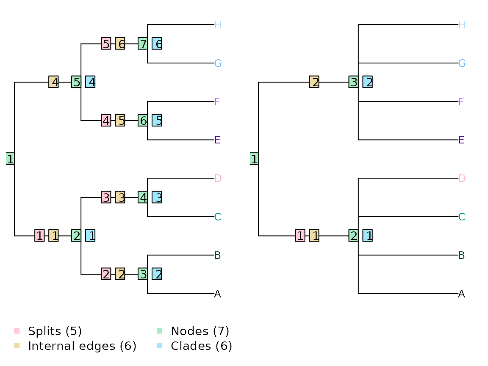
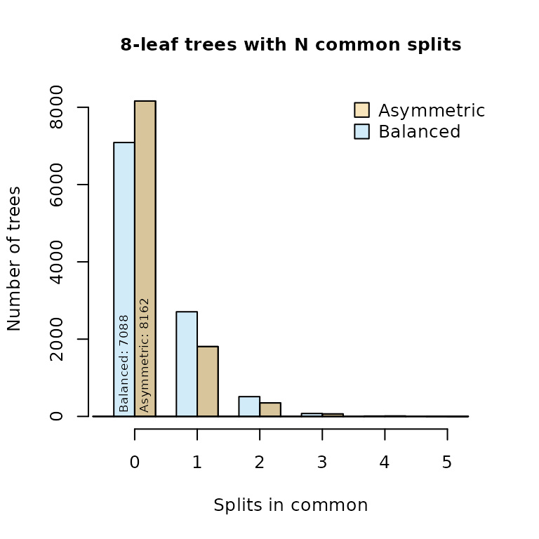
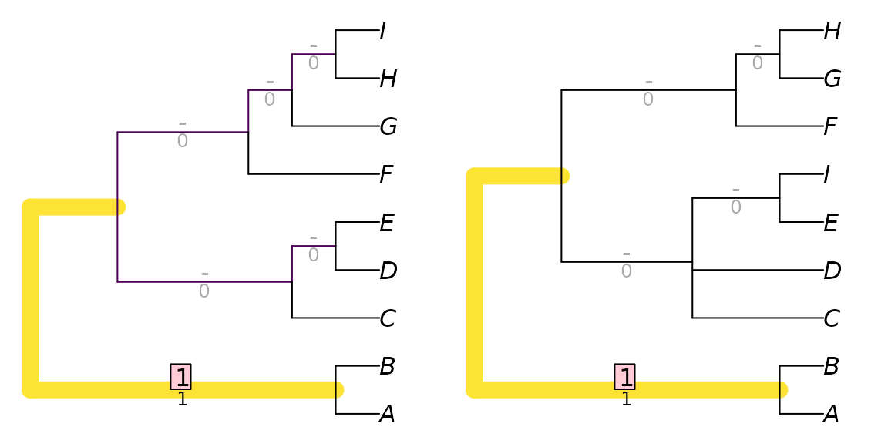
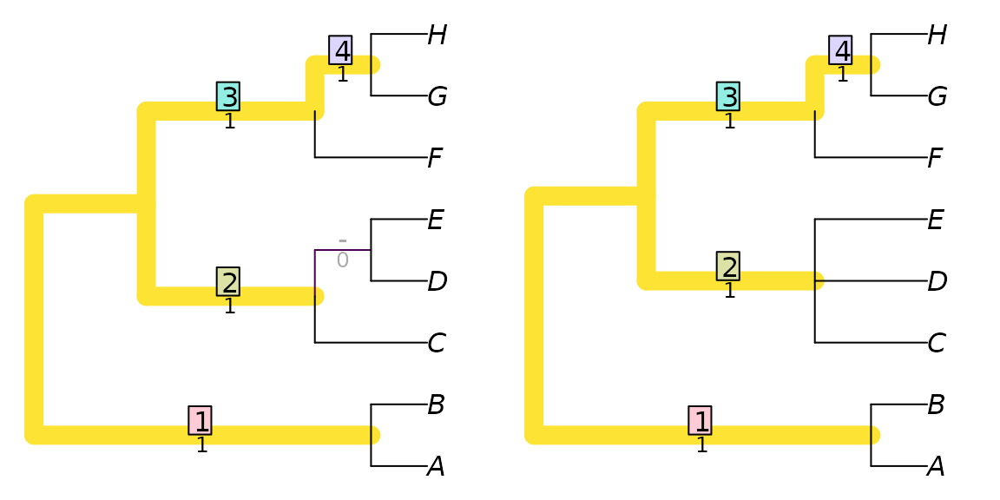

# Extending the Robinson-Foulds metric

## The Robinson–Foulds distance

An intuitive way to calculate the similarity between two trees is to
calculate the resolution of their strict consensus, which corresponds to
the number of splits that occur in both trees (Schuh & Polhemus, 1980).
The corresponding distance measure, the Robinson–Foulds distance
(Robinson & Foulds, 1981), counts the number of splits that are unique
to one of the two trees.

It is important to remember that counting splits is not the same as
counting clades, edges or nodes. If a tree is drawn as rooted (even
without a root edge), then the number of splits is one less than the
number of edges or clades, and two less than the number of nodes. For
example, the trees below have one split, two edges and three nodes in
common.



The simplicity of counting splits is appealing, but limited by the
underlying assumption that all splits are equivalent.

As an example, a split that separates eight leaves into two sets of four
(as in the right-hand tree above) has a $\frac{1}{35}$ chance of being
compatible with the reference tree. In contrast, a split that separates
two leaves from the other six has a $\frac{1}{7}$ chance of matching the
reference tree: the similarity observed is five times more likely to
have arisen by chance. In other words, failure to match an even split is
less noteworthy than failure to match an uneven one.

As a consequence, trees whose splits are less even will, on average,
exhibit higher Robinson–Foulds distances with comparison trees. Compare
a balanced and an unbalanced eight-taxon tree:


Each tree divides the eight taxa into five splits. The [phylogenetic
information
content](https://ms609.github.io/TreeDist/dev/articles/information.md)
of a split is a function of the probability that the split will match a
uniformly chosen random tree, i.e. the proportion of eight-leaf binary
trees that contain the split in question. (Information content, in bits,
is defined as $- \log_{2}\left( \text{probability} \right)$.) This, in
turn, is a function of the evenness of the split:

|                 | Matching trees | *P*(Match in random tree) | Phylogenetic information content |
|:----------------|:---------------|:--------------------------|:---------------------------------|
| Split size: 2:6 | 945 / 10 395   | 0.0909                    | 3.46 bits                        |
| Split size: 3:5 | 315 / 10 395   | 0.0303                    | 5.04 bits                        |
| Split size: 4:4 | 225 / 10 395   | 0.0216                    | 5.53 bits                        |

In the first tree, split 1 is even, dividing four taxa from four others
(`4|4`); splits 2–5 are maximally uneven (`2|6`). If each split is
treated as independent, then the total information content of the five
splits is 19.37 bits, whereas that of the five splits in the second
tree, of sizes `2|6`, `3|5`, `4|4`, `3|5` and `2|6`, is 22.54 bits. Put
another way, a random tree will on average share more splits with the
balanced tree (whose splits are predominantly uneven and thus likely to
be matched) than the asymmetric tree (which contains more even splits
that are less likely to occur in a random tree).

Indeed, of the 10 395 eight-leaf trees, many more bear at least one
split in common with a balanced tree than with an asymmetric tree:



## Information-corrected Robinson–Foulds distance

This differing information content can be accommodated by weighting each
split according to the amount of phylogenetic information it contains
(Smith, 2020). The two tree pairs below both have a Robinson–Foulds
distance of two, but the first pair differ with regard to an uneven
split (`ABCDEF|GH`), so obtain a total difference of 22.54 − (3.46 +
5.04 + 5.53 + 5.04) = 3.46 bits:

``` r
tree1 <- ape::read.tree(text='(1, (2, (3, (4, (5, (6, (7, 8)))))));')
tree2 <- ape::read.tree(text='(1, (2, (3, (4, (5, (7, (6, 8)))))));')
tree3 <- ape::read.tree(text='(1, (2, (3, (5, (4, (6, (7, 8)))))));')

VisualizeMatching(InfoRobinsonFoulds, tree1, tree2, 
                  Plot = TreeDistPlot, prune = 12)
```


whereas the second pair differ in the resolution of a more even, and
thus more information-rich, split (`ABCD|EFGH`), and so receive a
distance score of 5.53 bits:

``` r
VisualizeMatching(InfoRobinsonFoulds, tree1, tree3, 
                  Plot = TreeDistPlot, prune = 8)
```


## Generalized Robinson–Foulds distances

Even when accounting for the information content of splits in this way,
the Robinson–Foulds distance is readily saturated: the maximum value can
be obtained by moving a single leaf.

``` r
tree1 <- ape::read.tree(text='(1, (2, (3, (4, (5, (6, (7, 8)))))));')
tree2 <- ape::read.tree(text='(8, (1, (2, (3, (4, (5, (6, 7)))))));')

VisualizeMatching(RobinsonFouldsMatching, tree1, tree2, Plot = TreeDistPlot)
```


Generalized Robinson–Foulds distances (Böcker et al., 2013; Nye et al.,
2006) seek to address this issue. This category of metrics aim to
acknowledge semblances between similar-but-not-quite-identical pairs of
splits, which would contribute zero to tree similarity under the
standard Robinson–Foulds measure.

Generalized RF distances work by finding a *matching* that pairs splits
from one tree with splits in the other. Each pairing is scored according
to the similarity of the paired splits; the sum of these scores is the
score of the matching. The tree distance is given by the score of the
optimal matching.

### Constructing a matching

Let’s consider two trees that differ in the position of one wildcard
leaf, and in the resolution of a clade:

``` r
tree1 <- ape::read.tree(text='((A, B), ((C, (D, E)), (F, (G, (H, I)))));')
tree2 <- ape::read.tree(text='((A, B), ((C, D, (E, I)), (F, (G, H))));')

Plot(tree1, tree2, highlight = 'I', prune = list(8, integer(0)))
```


These trees obtain a Robinson–Foulds distance of nine: a large
distances, as the maximum possible for trees of this resolution is
eleven. `AB|CDEFGHI` is the only split in common between the two trees:

``` r
TwoTreePlot()
VisualizeMatching(RobinsonFouldsMatching, tree1, tree2)
```



This distance score is higher than might be expected, given how much the
trees have in common; removing the single leaf ‘I’ results in two trees
that differ only in the resolution of a single node:

``` r
TwoTreePlot()
VisualizeMatching(RobinsonFouldsMatching,
                  drop.tip(tree1, 'I'),
                  drop.tip(tree2, 'I'))
```



This hidden similarity can be better reflected if similar, but
non-identical, splits are assigned non-zero similarity scores.

There are various ways to score the similarity between two splits. One
is to build on the idea introduced above, where identical splits are
scored according to their phylogenetic information content. Non-matching
splits can be scored according to the amount of phylogenetic information
that they hold in common, which is a function of the proportion of trees
that are consistent with both splits. (A full explanation is provided in
the discussion of [Generalized Robinson–Foulds
distances](https://ms609.github.io/TreeDist/dev/articles/Generalized-RF.md).)

``` r
TwoTreePlot()
VisualizeMatching(SharedPhylogeneticInfo, tree1, tree2)
```


Here, the split `AB|CDEFGHI` occurs in both trees, and, as it happens,
makes the largest contribution to the tree similarity score (3.70) for
this particular pair of trees. This is the same contribution it would
have made to the information-corrected Robinson–Foulds similarity.

The split `ABCDEF|GHI` in the left-hand tree is paired with the split
`ABCDEFI|GH` in the right-hand tree. Had `ABCDEF|GHI` been available in
the right-hand tree, then this perfect match would have been assigned a
similarity of `SplitInformation(3, 6)` = 5.57 bits. The partial match is
instead allocated a lower score of 2.12 bits. Pairings of incompatible
splits, i.e. those that cannot co-exist on a tree, such as
`ABCDEFG|HI` - `ABCDFGH|EI`, have no phylogenetic information in common.
([clustering
information](https://ms609.github.io/TreeDist/dev/articles/information.md)
is an alternative way to think about split similarity that recognizes
similarity even between incompatible splits.)

The matching depicted above is one of many. It happens to be optimal: an
optimal matching can be found by considering the similarity score of
each possible pairing, and solving a linear assignment problem to find
the optimal set of pairings.

We can view the splits in each tree, named according to the number of
their associated node:

``` r
summary(TreeTools::as.Splits(tree1, LETTERS[1:9]))
```

    ## 6 bipartition splits dividing 9 tips, A .. I
    ##      123456789
    ##  11  **.......
    ##  13  ..***....
    ##  14  ...**....
    ##  15  .....****
    ##  16  ......***
    ##  17  .......**
    ## 
    ##  Tip 1: A     Tip 2: B    Tip 3: C    Tip 4: D    Tip 5: E   
    ##  Tip 6: F     Tip 7: G    Tip 8: H    Tip 9: I   

``` r
summary(TreeTools::as.Splits(tree2, LETTERS[1:9]))
```

    ## 5 bipartition splits dividing 9 tips, A .. I
    ##      123456789
    ##  11  **.......
    ##  13  ..***...*
    ##  14  ....*...*
    ##  15  .....***.
    ##  16  ......**.
    ## 
    ##  Tip 1: A     Tip 2: B    Tip 3: C    Tip 4: D    Tip 5: E   
    ##  Tip 6: F     Tip 7: G    Tip 8: H    Tip 9: I   

We can then see the similarity scores for each pair of splits, along
with the optimal matching:

``` r
attributes(SharedPhylogeneticInfo(tree1, tree2, reportMatching = TRUE))
```

    ## $matching
    ## [1]  1  2 NA  4  5  3
    ## 
    ## $matchedSplits
    ## [1] "A B | C D E F G H I => A B | C D E F G H I"
    ## [2] "C D E | A B F G H I => C D E I | A B F G H"
    ## [3] "F G H I | A B C D E => F G H | A B C D E I"
    ## [4] "G H I | A B C D E F => G H | A B C D E F I"
    ## [5] "H I | A B C D E F G .. E I | A B C D F G H"
    ## 
    ## $matchedScores
    ## [1] 3.700440 3.252981       NA 3.252981 2.115477 0.000000
    ## 
    ## $pairScores
    ##           [,1]      [,2]      [,3]      [,4]      [,5]
    ## [1,] 3.7004397 0.8930848 0.2410081 0.5305147 0.2410081
    ## [2,] 0.5305147 3.2529807 0.0000000 1.1825914 0.5305147
    ## [3,] 0.2410081 1.3785116 0.0000000 0.5305147 0.2410081
    ## [4,] 0.8930848 0.0000000 0.0000000 3.2529807 1.3785116
    ## [5,] 0.5305147 0.0000000 0.0000000 0.0000000 2.1154772
    ## [6,] 0.2410081 0.0000000 0.0000000 0.0000000 0.0000000

`..` denotes that the fifth matching contributes zero to similarity
score; an alternative optimal matching would leave these splits
unpaired.

### What next?

- Alternatives measures of split similarity, such as [mutual clustering
  information](https://ms609.github.io/TreeDist/dev/articles/information.md),
  give rise to other [Generalized Robinson–Foulds
  distances](https://ms609.github.io/TreeDist/dev/articles/Generalized-RF.md),
  and can be used to generate meaningful [tree
  spaces](https://ms609.github.io/TreeDist/dev/articles/treespace.md).

### References

Böcker, S., Canzar, S., & Klau, G. W. (2013). The generalized
Robinson-Foulds metric. In A. Darling & J. Stoye (Eds.), *Algorithms in
Bioinformatics. WABI 2013. Lecture Notes in Computer Science, vol 8126*
(pp. 156–169). Springer. <https://doi.org/10.1007/978-3-642-40453-5_13>

Nye, T. M. W., Liò, P., & Gilks, W. R. (2006). A novel algorithm and
web-based tool for comparing two alternative phylogenetic trees.
*Bioinformatics*, *22*(1), 117–119.
<https://doi.org/10.1093/bioinformatics/bti720>

Robinson, D. F., & Foulds, L. R. (1981). Comparison of phylogenetic
trees. *Mathematical Biosciences*, *53*(1-2), 131–147.
<https://doi.org/10.1016/0025-5564(81)90043-2>

Schuh, R. T., & Polhemus, J. T. (1980). Analysis of taxonomic congruence
among morphological, ecological and biogeographic data sets for the
Leptopodomorpha (Hemiptera). *Systematic Biology*, *29*(1), 1–26.
<https://doi.org/10.1093/sysbio/29.1.1>

Smith, M. R. (2020). Information theoretic Generalized Robinson-Foulds
metrics for comparing phylogenetic trees. *Bioinformatics*, *36*(20),
5007–5013. <https://doi.org/10.1093/bioinformatics/btaa614>
