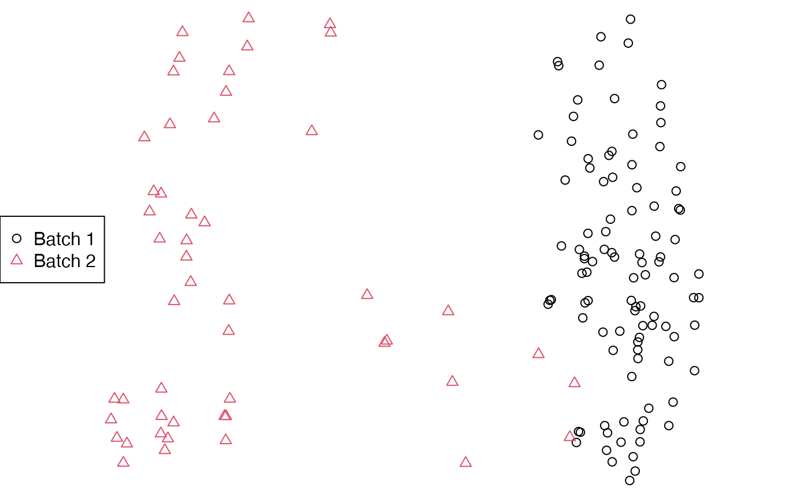
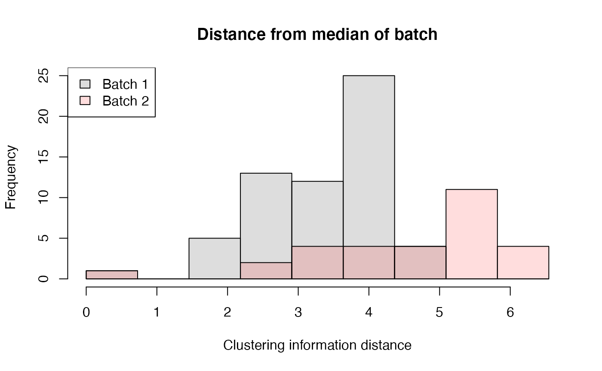

# Comparing sets of trees from different analyses

A common application of tree space analysis is to compare the outputs of
different analyses – for instance, trees obtained from different gene
sequences, or results obtained using different models or methods
(e.g. Bayesian, maximum likelihood, or parsimony).

## Shiny app

This can be accomplished quickly using the
[`MapTrees()`](https://ms609.github.io/TreeDist/dev/reference/MapTrees.md)
graphical user interface:

- Load trees from file: Select first tree file

- Select an appropriate sample size

- Select Replace existing

- Load each additional set of trees from file using Add batch to
  existing


Load tree batches

- On the Display tab, select Point symbols: One per batch, or Colour
  points by: Batch


Tree batch styles

## Scripting at the R command line

More control over the mapping can be obtained at the command line:

``` r
# Load trees
library("TreeTools", quietly = TRUE)
batch1 <- as.phylo(1:60, 8) # Generate 60 similar trees 
batch2 <- as.phylo(seq(200, 800, length.out = 30), 8) # A separate batch of 30 trees
styles <- c(1, 2) # Select plotting colours / symbols
treeStyle <- rep(styles, c(length(batch1), length(batch2)))

# Calculate distances
library("TreeDist")
distances <- ClusteringInfoDistance(c(batch1, batch2))

# Construct over-simple 2D PCoA mapping
mapping <- cmdscale(distances, k = 2)
```

``` r
# Plot mapping
par(mar = rep(0, 4))
plot(mapping,
     asp = 1, # Preserve aspect ratio - do not distort distances
     ann = FALSE, axes = FALSE, # Don't label axes: dimensions are meaningless
     col = treeStyle, # Colour
     pch = treeStyle # Plotting symbol
     )
legend("left", c("Batch 1", "Batch 2"), col = styles, pch = styles)
```



For more robust analyses than the (potentially misleading!) 2D plot
above, consult the companion
[vignette](https://ms609.github.io/TreeDist/dev/articles/treespace.md).
Note also that mapped areas and their regions of overlap may not
correspond to reality; see the warnings and recommendations in Smith
(2022a).

## Comparing trees’ dispersal / hypervolume

Interpreting and comparing the areas of tree space from a projection can
be misleading – the expanded apparent area of Greenland under the
Mercator projection being a familiar example.


Mapping can introduce distortion

As such, it is always best to work with original distances when
interpreting whether sets of trees occupy larger or smaller regions of
tree space.

### Distances from median

One approach is to plot distances from a median tree:

``` r
# Calculate median trees
median1 <- median(batch1)
median2 <- median(batch2)

# Compute distance from each tree to the median of its batch
dist1 <- ClusteringInfoDist(batch1, median1)
dist2 <- ClusteringInfoDist(batch2, median2)

# Set resolution of histogram
nBreaks <- 10
breaks <- seq(0, max(dist1, dist2), length.out = nBreaks)

# Plot first distance set
hist(dist1, col = "#00000022", breaks = breaks,
     main = "Distance from median of batch",
     xlab = "Clustering information distance",
     ylim = c(0, 25) # Omit this line to infer Y axis limit from first batch.
     )

# Add second distance set
hist(dist2, col = "#ff000022", breaks = breaks, add = TRUE)

# Add legend
legend("topleft", c("Batch 1", "Batch 2"),
       fill = c("#00000022",  "#ff000022"))
```



In the plotted example, distances to the median tree are greater for
batch 2 than batch 1, indicating a more dispersed set of trees that
occupies a greater hypervolume. Note that the increased frequency at
higher distances is expected: the outer shell of a sphere contains more
volume than a layer of equivalent thickness closer to the centre, and
this phenomenon becomes more pronounced as the dimensionality of tree
space increases.

### Consensus resolution

A complementary approach is to identify the resolution of the consensus
of each batch of trees. This approach shares many of the [problems with
the Robinson–Foulds
distance](https://ms609.github.io/TreeDist/articles/Robinson-Foulds.html):
in particular, resolution can be decimated by a single “rogue” taxon
whose position is poorly defined (Smith, 2022b). Detecting and removing
rogue taxa can provide a more meaningful point of comparison.

``` r
# Create tree set with a rogue taxon
batch3 <- AddTipEverywhere(as.phylo(7, 7), "t8")

# Set up plotting area
par(mfrow = c(2, 2), mar = rep(0.4, 4))

# Plot naive strict consensus
plot(consensus(batch1, p = 1))
plot(consensus(batch3, p = 1))

if (requireNamespace("Rogue", quietly = TRUE)) {
  cons1 <- ConsensusWithout(batch1, p = 1,
                            Rogue::QuickRogue(batch1, p = 1)[-1, "taxon"])
  cons3 <- ConsensusWithout(batch3, p = 1,
                            Rogue::QuickRogue(batch3, p = 1)[-1, "taxon"])
  
  # The information content of each tree gives a measure of its resolution,
  # accounting for omitted rogue leaves
  SplitwiseInfo(cons1) # 8.5 bits
  SplitwiseInfo(cons3) # 15.1 bits: higher resolution indicates that these
  # trees are more similar, notwithstanding rogue taxa.
  
  # Plot the trees
  plot(cons1)
  plot(cons3)
} else {
  message("The package 'Rogue' is required to run this example.")
}
```


Whereas a direct interpretation of this analysis is not straightforward,
it can provide a complementary way of understanding the distribution of
trees across tree space.

## References

Smith, M. R. (2022a). Robust analysis of phylogenetic tree space.
*Systematic Biology*, *71*(5), 1255–1270.
<https://doi.org/10.1093/sysbio/syab100>

Smith, M. R. (2022b). Using information theory to detect rogue taxa and
improve consensus trees. *Systematic Biology*, *71*(5), 1088–1094.
<https://doi.org/10.1093/sysbio/syab099>
