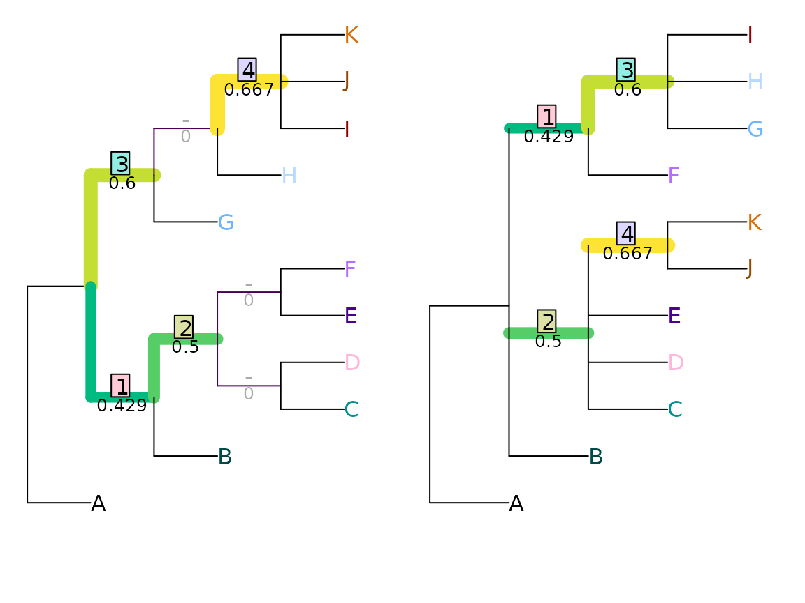
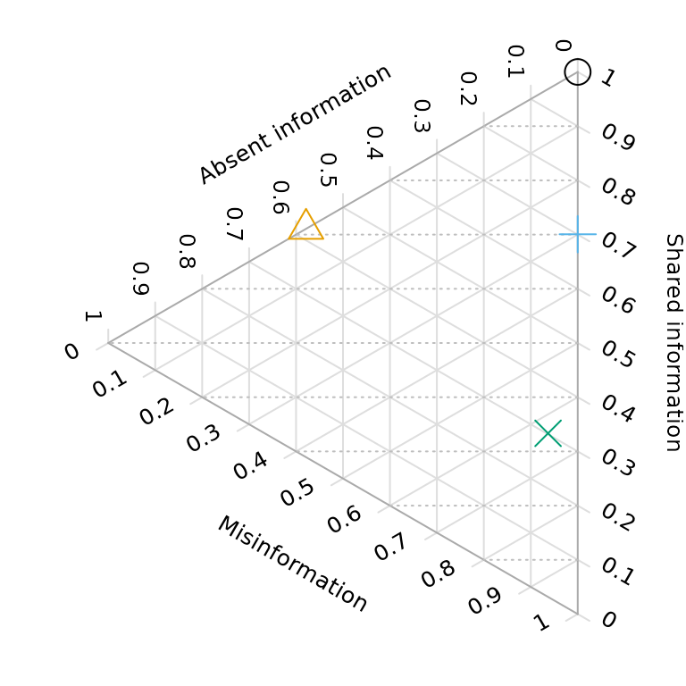

# Contextualizing tree distances

Once you understand [how to use
“TreeDist”](https://ms609.github.io/TreeDist/dev/articles/Using-TreeDist.md)
to calculate tree distances, the next step is to provide some context
for the calculated distances.

## Normalizing

The maximum value of most tree distance metrics scales with the size of
the trees being compared. Typically, the resolution of the trees also
impacts the range of possible values. As such, it can be difficult to
interpret the tree distance value without suitable context.

Normalizing a distance metric is one way to render its meaning more
obvious. Selecting an appropriate normalizing constant may require
careful consideration of the purpose to which a tree distance metric is
being put.

The default normalization behaviour of each function when
`normalize = TRUE` is listed in the [function
reference](https://ms609.github.io/TreeDist/dev/reference/00Index.md),
or can be viewed by typing `?FunctionName` in the R terminal.

### Nye *et al.* tree similarity

Let’s work through a simple example using the Nye *et al*. (2006)
similarity metric to compare two imperfectly-resolved trees.

``` r
library("TreeDist")
tree1 <- ape::read.tree(text = '(A, ((B, ((C, D), (E, F))), (G, (H, (I, J, K)))));')
tree2 <- ape::read.tree(text = '(A, (B, (C, D, E, (J, K)), (F, (G, H, I))));')
VisualizeMatching(NyeSimilarity, tree1, tree2,
                  Plot = TreeDistPlot, matchZeros = FALSE)
```



This is a nice metric to start with, because the maximum similarity
between each pair of splits is defined as one. (Astute readers might
worry that the minimum similarity is greater than zero – that’s a harder
problem to overcome.)

As such, the maximum similarity possible between two 11-leaf trees is
[`NSplits(11)`](https://ms609.github.io/TreeTools/reference/NSplits.html)
= 8.

Normalizing against this value tells us how similar the two trees are,
compared to two identical eleven-leaf binary trees.

``` r
NyeSimilarity(tree1, tree2, normalize = FALSE) / 8
```

    ## [1] 0.2744048

``` r
NyeSimilarity(tree1, tree2, normalize = 8)
```

    ## [1] 0.2744048

This approach will result in a similarity score less than one if two
trees are identical, but not fully resolved (i.e. binary).  
As such, we might prefer to compare the tree similarity to the maximum
score possible for two trees of the specified resolution. This value is
given by the number of splits in the least resolved of the two trees:

``` r
NyeSimilarity(tree1, tree2,
                  normalize = min(TreeTools::NSplits(list(tree1, tree2))))
```

    ## [1] 0.5488095

More concisely, we can provide a normalizing function:

``` r
NyeSimilarity(tree1, tree2, normalize = min)
```

    ## [1] 0.2744048

This approach will produce a similarity of one if one tree is a
less-resolved version of another (and thus not identical).

If we are comparing lists of trees, this best value will depend on the
number of splits in each pair of trees. We can use the function
[`pmin()`](https://rdrr.io/r/base/Extremes.html) to select the less
resolved of each pair of trees:

``` r
NyeSimilarity(list(tree1, tree2), list(tree1, tree2), normalize = pmin)
```

    ##           [,1]      [,2]
    ## [1,] 0.8750000 0.2744048
    ## [2,] 0.2744048 0.5000000

To avoid these limitations, we may instead opt to normalize against the
average number of splits in the two trees. This is the default
normalization method for
[`NyeSimilarity()`](https://ms609.github.io/TreeDist/dev/reference/NyeSimilarity.md):

``` r
NyeSimilarity(tree1, tree2, normalize = TRUE)
```

    ## [1] 0.3991342

Finally, if `tree1` is a “target” tree – perhaps one that has been used
to simulate data from, or which is independently known to be true or
virtuous – we may wish to normalize against the best possible match to
that tree.

In that case, the best possible score is

``` r
TreeTools::NSplits(tree1)
```

    ## [1] 7

and our normalized score will be

``` r
NyeSimilarity(tree1, tree2, normalize = TreeTools::NSplits(tree1))
```

    ## [1] 0.3136054

### Normalizing to random similarity

The diameter (maximum possible distance) of the Nye *et al*. tree
similarity metric is easy to calculate, but this is not the case for all
metrics. For example, the clustering information distance metric (Smith,
2020) ranges in principle from zero to the total clustering entropy
present in a pair of trees. But with even a modest number of leaves, no
pairs of trees exist in which every split in one tree is perfectly
contradicted by every other split in the other; as such, any pair of
trees will necessarily have some degree of similarity.  
In such a context, it can be relevant to normalize tree similarity
against the *expected* distance between a pair of random trees, rather
than a maximum value (see Vinh, Epps, & Bailey, 2010). On this measure,
distances greater than one denote trees that are more different than
expected by chance, whereas a distance of zero denotes identity.

With the quartet divergence, the expected tree distance is readily
calculated: any given quartet has a one in three chance of matching by
chance.

``` r
library("Quartet", exclude = "RobinsonFoulds")
expectedQD <- 2 / 3
normalizedQD <- QuartetDivergence(QuartetStatus(tree1, tree2),
                                  similarity = FALSE) / expectedQD
```

The expected distance is more difficult to calculate for other metrics,
but can be approximated by sampling random pairs of trees. Measured
distances between 10 000 pairs of random bifurcating trees with up to
200 leaves are available in the data package
‘[TreeDistData](https://github.com/ms609/TreeDistData/)’. We can view
(normalized) distances for a selection of methods:

``` r
if (requireNamespace("TreeDistData", quietly = TRUE)) {
  library("TreeDistData", exclude = "PairwiseDistances")
  data("randomTreeDistances", package = "TreeDistData")
  
  methods <- c("pid", "cid", "nye", "qd")
  methodCol <- c(pid = "#e15659", cid = "#58a14e", nye = "#edc949",
                 qd = "#af7aa1")
  
  oldPar <- par(cex = 0.7, mar = c(5, 5, 0.01, 0.01))
  nLeaves <- as.integer(dimnames(randomTreeDistances)[[3]])
  plot(nLeaves, type = "n", randomTreeDistances["pid", "mean", ],
       ylim = c(0.54, 1),
       xlab = "Number of leaves",
       ylab = "Normalized distance between random tree pairs")
  
  for (method in methods) {
    dat <- randomTreeDistances[method, , ]
    lines(nLeaves, dat["50%", ], pch = 1, col = methodCol[method])
    polygon(c(nLeaves, rev(nLeaves)), c(dat["25%", ], rev(dat["75%", ])),
            border = NA, col = paste0(methodCol[method], "55"))
    
  }
  
  text(202, randomTreeDistances[methods, "50%", "200"] + 0.02, 
       c("Different phylogenetic information", 
         "Clustering information distance",
         expression(paste(plain("Nye "), italic("et al."))),
         "Quartet divergence"
         ), col = methodCol[methods], pos = 2)
  par(oldPar)
}
```


or use these calculated values to normalize our tree distance:

``` r
expectedCID <- randomTreeDistances["cid", "mean", "9"]
ClusteringInfoDistance(tree1, tree2, normalize = TRUE) / expectedCID
```

## Testing similarity to a known tree

Similarity has two components: precision and accuracy (Smith, 2019). A
tree can be 80% similar to a target tree because it contains 80% of the
splits in the target tree, and no incorrect splits – or because it is a
binary tree in which 10% of the splits present are resolved incorrectly
and are thus positively misleading.

In such a comparison, of course, it is more sensible to talk about split
*information* than just the number of splits: an even split may contain
more information than two very uneven splits, so the absence of two
information-poor splits may be preferable to the absence of one
information-rich split. As such, it is most instructive to think of the
proportion of information that has been correctly resolved: the goal is
to find a tree that is as informative as possible about the true tree.

Ternary diagrams allow us to visualise the quality of a reconstructed
tree with reference to a known “true” tree:

``` r
testTrees <- list(
  trueTree = ape::read.tree(text = '(a, (b, (c, (d, (e, (f, (g, h)))))));'),
  lackRes = ape::read.tree(text = '(a, (b, c, (d, e, (f, g, h))));'),
  smallErr = ape::read.tree(text = '(a, (c, (b, (d, (f, (e, (g, h)))))));'),
  bigErr = ape::read.tree(text = '(a, (c, (((b, d), (f, h)), (e, g))));')
)
VisualizeMatching(MutualClusteringInfo, testTrees$trueTree, testTrees$lackRes)
points(4, 7.5, pch = 2, cex = 3, col = "#E69F00", xpd = NA)
```


``` r
VisualizeMatching(MutualClusteringInfo, testTrees$trueTree, testTrees$smallErr)
points(4, 7.5, pch = 3, cex = 3, col = "#56B4E9", xpd = NA)
```


``` r
VisualizeMatching(MutualClusteringInfo, testTrees$trueTree, testTrees$bigErr)
points(4, 7.5, pch = 4, cex = 3, col = "#009E73", xpd = NA)
```


Better trees plot vertically towards the “100% shared information”
vertex. Resolution of trees increases towards the right; trees that are
more resolved may be no better than less-resolved trees if the addition
of resolution introduces error.

``` r
if (requireNamespace("Ternary", quietly = TRUE)) {
  library("Ternary")
  oldPar <- par(mar = rep(0.1, 4))
  TernaryPlot(alab = "Absent information", blab = "Shared information",
              clab = "Misinformation",
              lab.cex = 0.8, lab.offset = 0.18,
              point = "left", clockwise = FALSE,
              grid.col = "#dedede", grid.minor.lines = 0,
              axis.labels = 0:10 / 10, axis.col = "#aaaaaa")
  
  HorizontalGrid()
  correct <- MutualClusteringInfo(testTrees$trueTree, testTrees)
  resolved <- ClusteringEntropy(testTrees)
  unresolved <- resolved["trueTree"] - resolved
  incorrect <- resolved - correct
  TernaryPoints(cbind(unresolved, correct, incorrect), 
                pch = 1:4, cex = 2, col = Ternary::cbPalette8[1:4])
  par(oldPar)
}
```



### Example

Here’s a noddy real-world example applying this to a simulation-style
study.

First, let’s generate a starting tree, which will represent our
reference topology:

``` r
set.seed(0)
trueTree <- TreeTools::RandomTree(20, root = TRUE)
```

Then, let’s generate 200 degraded trees. We’ll move away from the true
tree by making a TBR move, then reduce resolution by taking the
consensus of this tree and three trees from its immediate neighbourhood
(one NNI move away).

``` r
treeSearchInstalled <- requireNamespace("TreeSearch", quietly = TRUE)
if (treeSearchInstalled) {
  library("TreeSearch", quietly = TRUE) # for TBR, NNI
  oneAway <- structure(lapply(seq_len(200), function(x) {
    tbrTree <- TBR(trueTree)
    ape::consensus(list(tbrTree,
                        NNI(tbrTree),
                        NNI(tbrTree),
                        NNI(tbrTree)))
  }), class = "multiPhylo")
} else {
  message("Install \"TreeSearch\" to run this example")
}
```

And let’s generate 200 more trees that are even more degraded. This time
we’ll move further (three TBR moves) from the true tree, and reduce
resolution by taking a consensus with three trees from its wider
neighbourhood (each two NNI moves away).

``` r
if (treeSearchInstalled) {
  threeAway <- structure(lapply(seq_len(200), function(x) {
    tbrTree <- TBR(TBR(TBR(trueTree)))
    ape::consensus(list(tbrTree, 
                        NNI(NNI(tbrTree)),
                        NNI(NNI(tbrTree)),
                        NNI(NNI(tbrTree))))
  }), class = "multiPhylo")
}
```

Now let’s calculate their tree similarity scores. We need to calculate
the amount of information each tree has in common with the true tree:

``` r
if (treeSearchInstalled) {
  correct1 <- MutualClusteringInfo(trueTree, oneAway)
  correct3 <- MutualClusteringInfo(trueTree, threeAway)
}
```

The amount of information in each degraded tree:

``` r
if (treeSearchInstalled) {
  infoInTree1 <- ClusteringEntropy(oneAway)
  infoInTree3 <- ClusteringEntropy(threeAway)
}
```

The amount of information that could have been resolved, but was not:

``` r
if (treeSearchInstalled) {
  unresolved1 <- ClusteringEntropy(trueTree) - infoInTree1
  unresolved3 <- ClusteringEntropy(trueTree) - infoInTree3
}
```

And the amount of information incorrectly resolved:

``` r
if (treeSearchInstalled) {
  incorrect1 <- infoInTree1 - correct1
  incorrect3 <- infoInTree3 - correct3
}
```

In preparation for our plot, let’s colour our one-away trees  orange ,
and our three-away trees  blue :

``` r
col1 <- hcl(200, alpha = 0.9)
col3 <- hcl(40, alpha = 0.9)
spec1 <- matrix(col2rgb(col1, alpha = TRUE), nrow = 4, ncol = 181)
spec3 <- matrix(col2rgb(col3, alpha = TRUE), nrow = 4, ncol = 181)
spec1[4, ] <- spec3[4, ] <- 0:180
ColToHex <- function(x) rgb(x[1], x[2], x[3], x[4], maxColorValue = 255)
spec1 <- apply(spec1, 2, ColToHex)
spec3 <- apply(spec3, 2, ColToHex)
```

Now we can plot this information on a ternary diagram.

``` r
if (treeSearchInstalled && requireNamespace("Ternary", quietly = TRUE)) {
  layout(matrix(c(1, 2), ncol = 2), widths = c(5, 2))
  oldPar <- par(mar = rep(0, 4))
  TernaryPlot(alab = "Information absent in degraded tree", 
              blab = "\n\nCorrect information in degraded tree", 
              clab = "Misinformation in degraded tree",
              point = "left", clockwise = FALSE, grid.minor.lines = 0,
              axis.labels = 0:10 / 10)
  
  HorizontalGrid()
  
  coords1 <- cbind(unresolved1, correct1, incorrect1)
  coords3 <- cbind(unresolved3, correct3, incorrect3)
  
  ColourTernary(TernaryDensity(coords1, resolution = 20), spectrum = spec1)
  ColourTernary(TernaryDensity(coords3, resolution = 20), spectrum = spec3)
  
  TernaryDensityContour(coords3, col = col3, nlevels = 4)
  TernaryDensityContour(coords1, col = col1, nlevels = 4)
  
  if (requireNamespace("kdensity", quietly = TRUE)) {
    library("kdensity")
    HorizontalKDE <- function(dat, col, add = FALSE) {
      lty <- 1
      lwd <- 2
      kde <- kdensity(dat)
      kdeRange <- kdensity:::get_range(kde)
      if (add) {
        lines(kde(kdeRange), kdeRange, col = col, lty = lty, lwd = lwd)
      } else {
        plot(kde(kdeRange), kdeRange, col = col, lty = lty, lwd = lwd, 
             ylim = c(0, 1), main = "", axes = FALSE, type = "l")
      }
      # abline(h = 0:10 / 10) # Useful for confirming alignment
    }
  
    par(mar = c(1.8, 0, 1.8, 0)) # align plot limits with ternary plot
    HorizontalKDE(correct1 / infoInTree1, col1, add = FALSE)
    HorizontalKDE(correct3 / infoInTree3, col3, add = TRUE)
    mtext("\u2192 Normalized tree quality \u2192", 2)
  }
  par(oldPar)
} else {
  message("Install \"TreeSearch\" and \"Ternary\" to generate this plot")
}
```


In the ternary plot, the vertical direction corresponds to the
normalized tree quality, as depicted in the accompanying histogram.

## What next?

You may wish to:

- Explore the [Ternary package](https://ms609.github.io/Ternary/)

- [Interpret tree distance
  metrics](https://ms609.github.io/TreeDistData/articles/09-expected-similarity.html)

- Compare trees with [different
  tips](https://ms609.github.io/TreeDist/dev/articles/different-leaves.md)

- Review [available distance
  measures](https://ms609.github.io/TreeDist/index.html) and the
  corresponding [TreeDist
  functions](https://ms609.github.io/TreeDist/reference/index.html#section-tree-distance-measures)

- Construct [tree
  spaces](https://ms609.github.io/TreeDist/dev/articles/treespace.md) to
  visualize landscapes of phylogenetic trees

## References

Nye, T. M. W., Liò, P., & Gilks, W. R. (2006). A novel algorithm and
web-based tool for comparing two alternative phylogenetic trees.
*Bioinformatics*, *22*(1), 117–119. doi:
[10.1093/bioinformatics/bti720](https://doi.org/10.1093/bioinformatics/bti720)

Smith, M. R. (2019). Bayesian and parsimony approaches reconstruct
informative trees from simulated morphological datasets. *Biology
Letters*, *15*(2), 20180632. doi:
[10.1098/rsbl.2018.0632](https://doi.org/10.1098/rsbl.2018.0632)

Smith, M. R. (2020). Information theoretic Generalized Robinson-Foulds
metrics for comparing phylogenetic trees. *Bioinformatics*, *36*(20),
5007–5013. doi:
[10.1093/bioinformatics/btaa614](https://doi.org/10.1093/bioinformatics/btaa614)

Vinh, N. X., Epps, J., & Bailey, J. (2010). Information theoretic
measures for clusterings comparison: variants, properties, normalization
and correction for chance. *Journal of Machine Learning Research*, *11*,
2837–2854. doi:
[10.1145/1553374.1553511](https://doi.org/10.1145/1553374.1553511)
