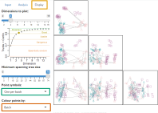

A common application of tree space analysis is to compare the outputs of
different analyses – for instance, trees obtained from different gene sequences,
or results obtained using different models or methods 
(e.g. Bayesian, maximum likelihood, or parsimony).

This can be accomplished quickly using the `MapTrees()` GUI:


Or you can do this in the TreeDist GUI:

- <span style="border: solid 2px #e69f00">Load trees</span> from file: Select first tree file

- Select an appropriate sample size

- Select <span style="border: solid 2px #009e73">Replace existing</span>

- Load each additional set of trees from file using <span style="border: solid 2px #d55e00">Add batch to existing</span>

{ width=245px }


- On the <span style="border: solid 2px #e69f00">Display</span> tab, 
  select <span style="border: solid 2px #009e73">Point symbols: One per batch</span>,
  or <span style="border: solid 2px #d55e00">Colour points by: Batch</span>


{ width=100% }


At the command line, this can be accomplished as follows:

```{r generate-trees}
# Load trees
library("TreeTools", quietly = TRUE)
batch1 <- as.phylo(0:99, 8) # Generate 100 similar trees 
batch2 <- as.phylo(200:249, 8) # A separate batch of 50 trees
styles <- c(1, 2) # Select plotting colours / symbols
treeStyle <- rep(styles, c(length(batch1), length(batch2)))

# Calculate distances
library("TreeDist")
distances <- ClusteringInfoDistance(c(batch1, batch2))

# Construct over-simple 2D PCoA mapping
mapping <- cmdscale(distances, k = 2)
```

```{r plot-mapping}
# Plot mapping
par(mar = rep(0, 4))
plot(mapping,
     asp = 1, # Preserve aspect ratio - do not distort distances
     ann = FALSE, axes = FALSE, # Don't label axes: dimensions are meaningless
     col = treeStyle, # Colour
     pch = treeStyle # Plotting symbol
     )
legend("left", c("Batch 1", "Batch 2"), col = styles, pch = styles)
```

For a more suitable analysis than the simple 2D plot above, consult the
companion [vignette](treespace.html).
Even then, it's always worth being cautious before interpreting mapped areas;
see the warnings and recommendations in @SmithSpace.
