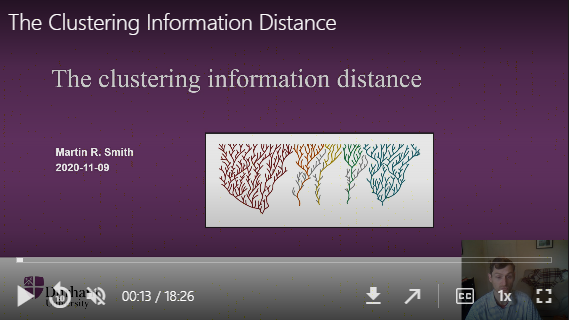

To understand the [information-based metrics](Generalized-RF.html) implemented
in '[TreeDist](Using-TreeDist.html)', it is useful to recall some basic concepts
of information theory.

For an introduction, see @Mackay2003 or an introductory video to the clustering
information distance:

[](https://durham.cloud.panopto.eu/Panopto/Pages/Viewer.aspx?id=ca5ede19-d21a-40ce-8b9e-ac6e00d7e2c0)


## Splits

Each internal edge in a tree represents a split that divides its leaves
into two partitions.  Intuitively, some splits are more instructive than
others.  For example, the fact that mammals and reptiles represent two separate
groups is profound enough that it is worth teaching to schoolchildren; much 
less information is represented by a split that identifies two species of bat as
more closely related to one another than to any other mammal or reptile.


## Quantifying information

How can we formalize the intuition that some splits contain more information
than others?  More generally, how can we quantify an amount of information?

Information is usually measured in _bits_.  One bit is the amount of information
generated by tossing a fair coin: to record the outcome of a coin toss, I must
record either a `H` or a `T`, and with each of the two symbols equally likely,
there is no way to compress the results of multiple tosses.

The Shannon [-@Shannon1948] information content of an outcome $x$ is defined 
to be $h(x) = -\log_2{P(x)}$, which simplifies to $\log_2{n}$ when all $n$ 
outcomes are equally likely.
Thus, the outcome of a fair coin toss delivers
$\log_2{2} = 1\textrm{ bit}$ of information;
the outcome of rolling a fair six-sided die contains
$\log_2{6} \approx 2.58\textrm{ bits}$ of information;
and the outcome of selecting at random one of the 105 unrooted binary six-leaf
trees is $\log_2{105} \approx 6.71\textrm{ bits}$.

Unlikely outcomes are more surprising, and thus contain more information than
likely outcomes.  The information content of rolling a twelve on two fair
six-sided dice is $-\log_2{\frac{1}{36}} \approx 5.16\textrm{ bits}$, whereas a seven,
which could be produced by six of the 36 possible rolls (`1 & 6`, `2 & 5`, ...),
is less surprising, and thus contains less information: 
$-\log_2{\frac{6}{36}} \approx 2.58\textrm{ bits}$.
An additional 2.58 bits of information would be required to establish which of
the six possible rolls produced the seven.


### Application to splits

The split $S_1 =$ `AB|CDEF` is found in 15 of the 105 six-leaf trees; 
as such, the probability that a randomly drawn tree contains $S_1$ is 
$P(S_1) = \frac{15}{105}$, and the information content $h(S_1) = 
-\log_2{\frac{15}{105}} \approx 2.81\textrm{ bits}$. @Steel2006 dub this 
quantity the **phylogenetic information content**.

Likewise, the split $S_2 =$ `ABC|DEF` occurs in nine of the 105 six-leaf trees,
so $h(S_2) = -\log_2{\frac{9}{105}} \approx 3.54\textrm{ bits}$.
Three six-leaf trees contain both splits, so in combination the splits deliver
$h(S_1,S_2) = -\log_2{\frac{3}{105}} \approx 5.13\textrm{ bits}$ of information.

Because $h(S_1,S_2) < h(S_1) + h(S_2)$, some of the information in $S_1$ is
also present in $S_2$.
The information in common between $S_1$ and $S_2$ is $h_{shared}(S_1, S_2) =
h(S_1) + h(S_2) - h(S_1,S_2) \approx 1.22\textrm{ bits}$.
The information unique to $S_1$ and $S_2$ is $h_{different}(S_1,S_2) = 
2h(S_1,S_2) - h(S_1) - h(S_2) \approx 3.91\textrm{ bits}$.

These quantities can be calculated using functions in the 
'[TreeTools](https://ms609.github.io/TreeTools/)' package.

```{r}
library('TreeTools', quietly = TRUE, warn.conflicts = FALSE)
library('TreeDist')
treesMatchingSplit <- c(
  AB.CDEF = TreesMatchingSplit(2, 4),
  ABC.DEF = TreesMatchingSplit(3, 3)
)
treesMatchingSplit

proportionMatchingSplit <- treesMatchingSplit / NUnrooted(6)
proportionMatchingSplit

splitInformation <- -log2(proportionMatchingSplit)
splitInformation

treesMatchingBoth <- TreesConsistentWithTwoSplits(6, 2, 3)
combinedInformation <- -log2(treesMatchingBoth / NUnrooted(6))

sharedInformation <- sum(splitInformation) - combinedInformation
sharedInformation

# Or more concisely:
SplitSharedInformation(n = 6, 2, 3)
```


<!--The more similar the splits, the more information they will have in common;
the shared information is maximised when $S_1 = S_2$, and $h_{common} = h(S_1)$.
Likewise, more even splits contain more information than less even splits
(i.e. _h_(`AB|CDEF`) < _h_(`ABC|DEF`)).-->

## Entropy

Entropy is the average information content of each outcome, weighted by its
probability: $\sum{-p \log_2(p)}$.  Where all $n$ outcomes are equiprobable, 
this simplifies to $\log_2{n}$.

Consider a case in which Jane rolls a dice, and makes two true statements
about the outcome $x$:

$S_1$: "Is the roll even?".

- Two equally-possible outcomes: yes or no
- Entropy: $H(S_1) = \log_2{2} = 1\textrm{ bit}$.

$S_2$: "Is the roll greater than 3?"

- Two equally-possible outcomes: yes or no
- Entropy: $H(S_2) = \log_2{2} = 1\textrm{ bit}$.


The joint entropy of $S_1$ and $S_2$ is the entropy of the association 
matrix that considers each possible outcome:

 &nbsp;        | $S_1: x$ odd            | $S_1: x$ even
-------------- | ----------------------- | -------------------
$S_2: x \le 3$ | $x \in {1, 3}; p = \frac{2}{6}$ | $x = 2; p = \frac{1}{6}$ |
$S_2: x > 3$   | $x = 5; p = \frac{1}{6}$    | $x \in {4, 6}; p = \frac{2}{6}$ |

$\begin{aligned}
H(S_1, S_2) = \frac{2}{3}\log_2{\frac{2}{3}} + \frac{1}{3}\log_2{\frac{1}{3}} + \frac{1}{3}\log_2{\frac{1}{3}} + \frac{2}{3}\log_2{\frac{2}{3}} \approx
1.84 \textrm{ bits}
\end{aligned}$
 

Note that this less than the $\log_2{6} \approx 2.58\textrm{ bits}$ we require 
to determine the exact value of the roll: knowledge of $S_1$ and $S_2$ is not 
guaranteed to be sufficient to unambiguously identify $x$.


The mutual information between $S_1$ and $S_2$ describes how much knowledge of
$S_1$ reduces our uncertainty in $S_2$ (or _vice versa_).
So if we learn that $S_1$ is 'even', we become a little more confident
that $S_2$ is 'greater than three'. 

The mutual information $I(S_1;S_2)$, denoted in blue below, corresponds to the
sum of the individual entropies, minus the joint entropy:

\begin{aligned}
I(S_1;S_2) = H(S_1) + H(S_2) - H(S_1, S_2)
\end{aligned}

If two statements have high mutual information, then once you have heard one
statement, you already have a good idea what the outcome of the other statement
will be, and thus learn little new on hearing it.


The entropy distance, also termed the variation of information [@Meila2007],
corresponds to the information that $S_1$ and $S_2$ do _not_ have in common
(denoted below in yellow):

\begin{aligned}
H_D(S_1, S_2) = H(S_1, S_2) - I(S_1;S_2) = 2H(S_1, S_2) - H(S_1) - H(S_2)
\end{aligned}

The higher the entropy distance, the harder it is to predict the outcome of one
statement from the other; the maximum entropy distance occurs when the two
statements are entirely independent.

```{r mackay-8-1, echo=FALSE, fig.width=4, out.width='50%', fig.height=3, fig.align='center'}
library('TreeDist')
H <- function(inBracket) {
  expression(paste(italic('H'), plain('('), italic(inBracket), plain(')')))
}
oldPar <- par(mar = c(3.1, 0.1, 0, 0.1))
joint <- Entropy(c(1, 2, 1, 2) / 6)
plot(0, type = 'n', xlim = c(0, joint), ylim = c(5, 0), axes = FALSE)
axis(1, at = c(0, 0.5, 1, 1.5, round(joint, 2)))
mtext('Entropy / bits', 1, 2)
rect(joint - 1, 3.1, 1, 3.9, col = "#56B4E9")
rect(0, 0.1, joint - 1, 0.9, col = "#F0E442", border = NA)
rect(1, 1.1, joint, 1.9, col = "#F0E442", border = NA)
rect(joint - 1, 1.1, 1, 1.9, col = "#56B4E9", border = NA)
rect(joint - 1, 0.1, 1, 0.9, col = "#56B4E9", border = NA)
text(1, 3.5, pos=4,
     expression(paste(italic(I), plain('('), italic('A;B'), plain(')'))))


rect(0, 2.1, joint, 2.9)
text(joint / 2, 2.5, 
     expression(paste(italic('H'), plain('('), italic('A, B'), plain(')'))))

rect(0, 0.1, 1, 0.9)
text(0.5, 0.5, 
     expression(paste(italic('H'), plain('('), italic(A), plain(')'))))


rect(joint - 1, 1.1, joint - 0, 1.9)
text(joint - 0.5, 1.5, 
     expression(paste(italic('H'), plain('('), italic(B), plain(')'))))


rect(0, 4.1, joint - 1, 4.9, col = "#F0E442")
rect(1, 4.1, joint, 4.9,     col = "#F0E442")
text(joint / 2, 4.5, 
     expression(paste(italic('H'['D']), plain('('), italic('A, B'), plain(')'))))
par(oldPar)
```

### Application to splits

A split divides leaves into two partitions.  If we arbitrarily label these
partitions 'A' and 'B', and select a leaf at random, we can view the partition
label associated with the leaf. 
If 60/100 leaves belong to partition 'A', and 40/100 to 'B', then the a leaf
drawn at random has a 40% chance of bearing the label 'A'; the split has an
entropy of $-\frac{60}{100}\log_2{\frac{60}{100}}-\frac{40}{100}\log_2{\frac{40}{100}} \approx 0.97\textrm{ bits}$.

Now consider a different split, perhaps in a different tree, that assigns
50 leaves from 'A' to a partition 'C', leaving the remaining 10 leaves from 'A',
along with the 40 from 'B', in partition 'D'.
This split has $-\frac{50}{100}\log_2{\frac{50}{100}}-\frac{50}{100}\log_2{\frac{50}{100}} = 1\textrm{ bit}$ of entropy.  
Put these together, and a randomly selected leaf may now bear one of three
possible labellings:

- 'A' and 'C': 50 leaves
- 'A' and 'D': 10 leaves
- 'B' and 'D': 40 leaves.

The two splits thus have a joint entropy of 
$-\frac{50}{100}\log_2{\frac{50}{100}}
-\frac{10}{100}\log_2{\frac{10}{100}}
-\frac{40}{100}\log_2{\frac{40}{100}} \approx 1.36\textrm{ bits} < 0.97 + 1$.

The joint entropy is less than the sum of the individual entropies because the
two splits contain some mutual information: for instance, if a leaf bears the
label 'B', we can be certain that it will also bear the label 'D'.
The more similar the splits are, and the more they agree in their division of
leaves, the more mutual information they will exhibit.
I term this the **clustering information**, in contradistinction to the 
concept of phylogenetic information discussed above.

More formally, let split $S$ divides $n$ leaves into two partitions $A$ and $B$.
The probability that a randomly chosen leaf $x$ is in partition $k$ is 
$P(x \in k) = \frac{|k|}{n}$.  $S$ thus corresponds to a random variable 
with entropy $H(S) = -\frac{|A|}{n} \log_2{\frac{|A|}{n}} - 
\frac{|B|}{n}\log_2{\frac{|B|}{n}}$ [@Meila2007].
The joint entropy of two splits, $S_1$ and $S_2$, corresponds to the entropy of
the association matrix of probabilities that a randomly selected leaf
belongs to each pair of partitions:

 &nbsp;          | $S_1: x \in A_1$               | $S_1: x \in B_1$
---------------- | ------------------------------ | ----------------------
$S_2: x \in A_2$ | $P(A_1,A_2) =
\frac{|A_1 \cap A_2|}{n}$ | $P(B_1,A_2) = \frac{|B_1 \cap A_2|}{n}$ |
$S_2: x \in B_2$ | $P(A_1,B_2) =
\frac{|A_1 \cap B_2|}{n}$ | $P(B_1,B_2) = \frac{|B_1 \cap B_2|}{n}$ |


$H(S_1, S_2) =
P(A_1,A_2) \log_2 {P(A_1,A_2)} + 
P(B_1,A_2) \log_2 {P(B_1,A_2)}$

$+ P(A_1,B_2)\log_2{P(A_1,B_2)} + 
P(B_1,B_2)\log_2{P(B_1,B_2)}$

These values can then be substituted into the definitions of mutual information
and entropy distance given above.

As $S_1$ and $S_2$ become more different, the disposition of $S_1$ gives less
information about the configuration of $S_2$, and the mutual information 
decreases accordingly.

## References
